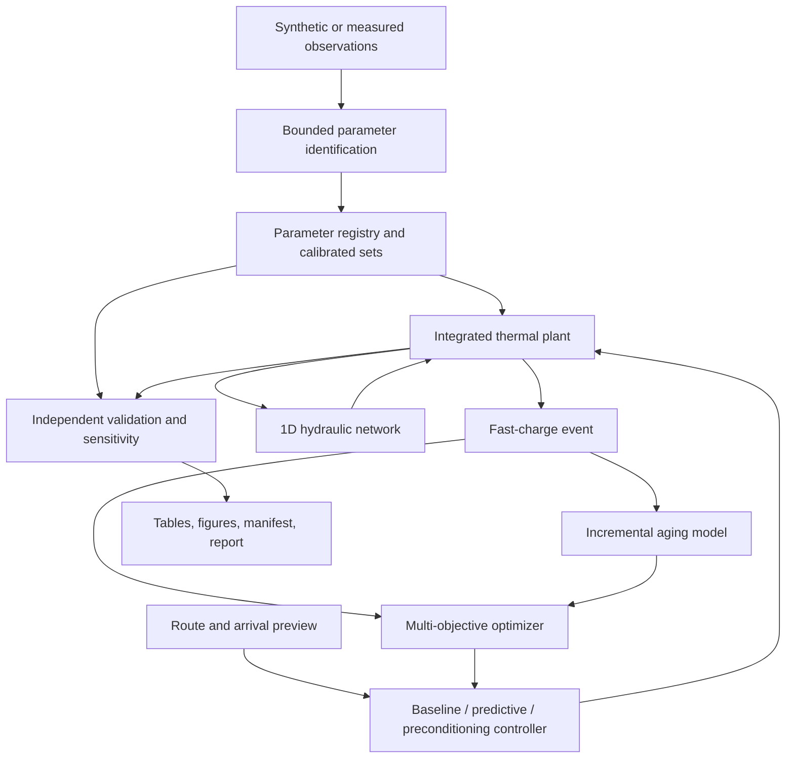
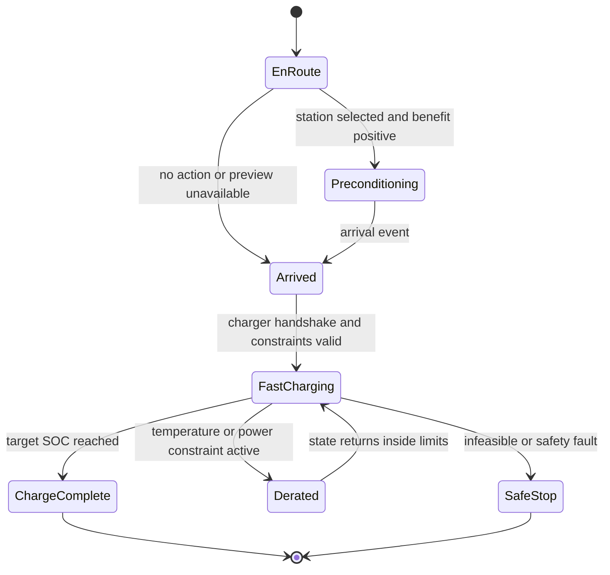

# feat: EV integrated thermal management engineering upgrade

## Goal Capsule

- **Objective:** 将现有整车集成热管理原型升级为可复现、可辨识、可验证、可做液路架构选型，并能研究快充到站预热与温度—充电时间—老化权衡的工程仿真平台。
- **Authority:** 用户已确定阶段顺序：先修复，再做参数辨识/V&V，再做一维液路与架构选型，最后做快充到站预热和联合优化。
- **Execution profile:** 在现有 Python 物理模型上渐进演化，测试先于或伴随行为修改；正式产物通过统一清单验收，快速烟测产物不得覆盖正式结果。
- **Stop conditions:** 真实试验数据缺失不阻止辨识管线和 synthetic truth recovery，但必须阻止任何“已完成实车模型确认”的表述；优化不可行时必须返回可解释状态，不能静默输出越界解。
- **Tail ownership:** 本地实现、测试、产物校验和文档同步属于本计划；提交、推送和 PR 仅在用户后续明确要求时执行。

---

## Product Contract

### Summary

项目需要从“系统级方法验证原型”升级为具有工程证据链的平台。升级后的主线是：同一套参数定义驱动物理仿真与辨识，辨识结果经过独立验证和不确定性审计，一维液路根据真实部件压降与泵曲线求工作点，快充场景再基于该物理系统研究预热、充电时间和老化的多目标权衡。

### Problem Frame

当前代码已有整车动力学、电池双节点热模型、电驱和座舱热模型、泵/冷板/换热器、状态机/PID、LSTM、守恒账本和23项自动化测试，但正式文档与仓库产物不一致。`results/logs/run_manifest.json`记录的是 quick 流程，`models/test_metrics.json`中的 R²为负，`docs/results_summary.md`却引用24个episode的正式结果，导致`experiments/verify_artifacts.py`失败。

液路实现也存在“独立模块比整车集成更深”的断层：`thermal_hydraulics/pipe.py`和液液换热器未进入`IntegratedSimulator`，整车仍通过固定二次阻力系数求泵工作点。后续快充与老化研究若直接建立在这套基线上，会放大不可辨识参数和热流路径误差。

### Requirements

**可复现基线**

- R1. 每次运行使用独立 run id 和产物目录，quick 不得提升 formal 指针或修改正式模型、表格、图和 manifest。
- R2. 正式验收必须验证24个独立episode、6工况双策略12行结果、有限数值、图表数量、配置哈希、随机种子和`quick=false`。
- R3. 文档中的预测指标和策略指标必须由正式产物自动生成或校验，不允许手工维护互相冲突的数字。

**参数辨识与 V&V**

- R4. 参数必须具有统一注册信息：名称、单位、默认值、上下界、来源、可信等级和适用模型。
- R5. 辨识接口必须支持合成真值回辨和外部 CSV 观测数据，输出估计值、置信信息、残差和数据集身份。
- R6. V&V 必须区分代码验证、数值验证、参数辨识验证和真实数据模型确认；没有真实数据时不得将 synthetic recovery 称为模型确认。
- R7. 必须提供局部灵敏度和全局抽样分析，报告输入参数对电池峰值温度、附件能耗和关键液路量的影响排序与区间。

**一维液路与架构选型**

- R8. 电池和电驱液路的工作点必须由泵曲线与管路、局部阻力、冷板/水套、阀门和换热器压降共同求解，禁止在整车模型中继续使用不透明固定阻力常数。
- R9. 网络必须输出各支路流量、总压降、泵效率/功率、关键出口温度和求解状态，并保持热量与液压方向不变量。
- R10. 比较独立双回路、液液换热耦合双回路和多通阀共享热汇三种架构，给出热安全、泵耗、换热能力和部件规格包络的可复现比较。

**快充到站预热与联合优化**

- R11. 快充模型必须包含 SOC/温度相关充电功率限制、CC-CV或等价分段充电过程、充电终止条件和充电期间热管理负荷。
- R12. 到站预热必须使用路线剩余时间、预计到站SOC、环境温度和当前电池热状态，支持无预热、规则预热和优化预热三种策略。
- R13. 老化模型必须显式依赖温度、SOC和倍率/Ah-throughput，输出本次行程与充电事件的增量损伤；其用途限定为相对策略比较。
- R14. 联合优化必须在温度、电压、SOC、充电功率和执行器约束下生成充电时间—热管理能耗—老化损伤 Pareto 结果，并保留可解释的基准策略。
- R15. 预测缺失、路线变化、到站时间偏差、环境偏差和优化不可行时必须有确定性回退和鲁棒性结果。

### Key Flows

- F1. **正式基线恢复**
  - **Trigger:** 执行正式全流程。
  - **Steps:** 生成正式数据集，训练预测器，运行六工况双策略，生成图表和 manifest，再由产物校验器交叉核对。
  - **Outcome:** 文档、模型、表格、图和 manifest 指向同一次正式运行；quick 烟测保留在隔离目录。
- F2. **参数辨识与验证**
  - **Trigger:** 提供实验/合成观测数据和待辨识参数集。
  - **Steps:** 校验单位与数据字段，固定未辨识参数，受界优化，输出残差与参数估计，在独立工况上验证，并运行灵敏度分析。
  - **Outcome:** 得到可追溯参数集和 V&V 报告；真实数据缺失状态被明确标记。
- F3. **液路工作点与架构比较**
  - **Trigger:** 控制器给出泵速和阀门命令。
  - **Steps:** 网络汇总部件压降，求泵/系统交点，计算支路流量与换热出口，更新热储能，再汇总架构级指标。
  - **Outcome:** 流量、压降、泵耗与换热由同一工作点闭合，不再使用固定阻力替代网络。
- F4. **到站预热和快充优化**
  - **Trigger:** 路线指定快充站与预计到站时间。
  - **Steps:** 预测到站热状态，选择预热/预冷轨迹，行驶到站后按约束充电，同时累计能耗、充电时间和老化损伤。
  - **Outcome:** 输出三策略对比、Pareto 前沿、约束状态和回退原因。

### Acceptance Examples

- AE1. 给定仓库中已有正式产物，运行 quick 流程后，正式 manifest、正式模型哈希和正式结果表保持不变，quick 产物出现在隔离目录。
- AE2. 给定一组隐藏合成参数和含噪温度轨迹，辨识结果回到允许误差内，独立验证轨迹优于默认参数；报告明确标记为 synthetic recovery。
- AE3. 给定相同泵速，将某段管路局部阻力增大后，网络流量下降、工作点泵压上升或保持物理一致，液压功不超过电功。
- AE4. 给定低温电池和固定到站时间，优化预热在所有温度/功率约束内完成充电，并相对无预热展示充电时间、能耗和老化的量化权衡。
- AE5. 给定不可达到的到站目标或求解失败，系统返回明确不可行/回退状态并执行安全规则策略，不产生 NaN、越界SOC或超限温度。

### Scope Boundaries

**In scope**

- Python 系统级集总参数模型、可插拔参数集、受界参数辨识、V&V和不确定性分析。
- 不可压缩稳态一维液压网络与准稳态换热，支持随整车时间步重复求解。
- 控制导向的快充、预热和半经验老化模型，以及离线多目标策略比较。

**Deferred to Follow-Up Work**

- 使用真实 HPPC、环境舱、泵/换热器台架和 CAN 数据完成具体车型模型确认。
- 与 GT-Suite/Amesim/Simulink 联合仿真、SIL/HIL 和量产标定工具链。
- 基于实车路线服务的在线速度/到站时间预测。

**Outside this product's identity**

- 三维 CFD、单体级热失控传播、完整制冷剂两相瞬态、可用于质保预测的寿命模型。

---

## Planning Contract

### Key Technical Decisions

- KTD1. **运行级产物目录和受控提升。** 每次运行写入`artifacts/runs/<run_id>`；只有通过验收的 formal run 可以提升正式指针并同步兼容路径，quick 永远不能提升 formal。
- KTD2. **一个参数注册表服务仿真、辨识和报告。** 不建立第二套“辨识专用参数”，避免单位、边界和默认值漂移。
- KTD3. **先做可辨识的灰箱模型。** 首版辨识聚焦电池热容/热导、回路阻力与换热参数；真实数据不足时仅进行 synthetic truth recovery。
- KTD4. **液路网络是深模块。** 外部接口只接收拓扑状态、流体温度和执行器命令，内部隐藏部件压降汇总、非线性求根和诊断。
- KTD5. **准稳态液压、动态热储能。** 每个整车时间步求稳态流量工作点，温度节点继续动态积分；不引入压力波和气蚀模型。
- KTD6. **快充研究保留可解释基准。** 无预热和规则预热始终与优化策略同场比较，避免只有优化器自身结果。
- KTD7. **老化值只用于相对比较。** 采用可配置的 Arrhenius/Ah-throughput 半经验损伤，不宣称具体车型寿命预测。
- KTD8. **优化失败不穿透安全层。** 优化器只生成候选轨迹；约束检查和规则回退是独立确定性路径。

### High-Level Technical Design

### Assumptions

- 当前没有可验证的具体车型试验数据，因此阶段二先交付数据接口、合成真值回辨和严格的 maturity 标签。
- 首版液路拓扑采用串联主回路加可配置支路/旁通，足以覆盖独立双回路与液液换热耦合架构。
- 首版联合优化以离线分析为目标，使用现有 SciPy 工具链；不要求车规实时部署。
- 现有共享压缩机能力、电热账本和预测故障回退属于必须保持的系统不变量。

### Phased Delivery

1. 基线修复完成并成为后续阶段硬门槛。
2. 参数注册、辨识、V&V先独立落地，再让液路和快充模型消费校准参数。
3. 液路网络先通过部件/网络测试，再替换整车固定阻力路径并做架构比较。
4. 快充模型先建立无预热基准，再加入规则预热，最后加入老化和联合优化。

---

## Implementation Units

### U1. Reproducible formal baseline and artifact isolation

- **Goal:** 修复 quick 覆盖正式产物的问题，恢复同一次运行内一致的正式证据链。
- **Requirements:** R1-R3；F1；AE1。
- **Dependencies:** 无。
- **Files:** `src/ev_thermal/artifacts.py`, `src/ev_thermal/pipeline.py`, `experiments/run_all.py`, `experiments/generate_dataset.py`, `experiments/train_predictor.py`, `experiments/run_comparison.py`, `experiments/verify_artifacts.py`, `.gitignore`, `tests/test_artifacts.py`, `tests/test_pipeline.py`, `README.md`, `docs/experiment_guide.md`, `docs/results_summary.md`。
- **Approach:** 定义 run-scoped artifact layout、运行状态和 quick/formal 指针；manifest加入 profile、代码/dirty状态、依赖版本、数据划分、配置与核心产物哈希；所有入口复用同一布局；校验器只允许完整 VERIFIED formal run 提升到兼容路径；正式结果摘要由已提升运行生成。
- **Execution note:** 先增加会复现“quick覆盖formal”与“quick冒充formal”的失败测试，再修改生产代码。
- **Patterns to follow:** `pipeline.run_all`的单入口编排、`tests/test_pipeline.py`的临时目录隔离、现有 manifest 哈希逻辑。
- **Test scenarios:**
  - quick 和 formal layout 返回不相交路径，formal 路径保持现有兼容位置。
  - quick 流程完成后，预先创建的 formal sentinel 文件哈希不变。
  - 中断或FAILED运行保留诊断但不能更新latest指针，跨run复制表格会因哈希/身份不一致而失败。
  - manifest 标记 quick 或 comparison rows 非12时，formal verifier明确失败。
  - 24 episode、12行有限结果、至少14张有效图且 manifest 为 formal 时通过。
- **Verification:** 23项既有测试与新增隔离测试通过；正式全流程完成；`verify_artifacts.py`退出码为0；文档数字与生成表一致。

### U2. Parameter registry and observation contracts

- **Goal:** 建立仿真、辨识和报告共享的参数元数据与观测数据合同。
- **Requirements:** R4-R6；F2。
- **Dependencies:** U1。
- **Files:** `src/ev_thermal/calibration/__init__.py`, `src/ev_thermal/calibration/parameters.py`, `src/ev_thermal/calibration/observations.py`, `configs/parameter_registry.yaml`, `tests/test_calibration_parameters.py`, `docs/parameter_identification.md`。
- **Approach:** 注册电池热参数、液路阻力/UA、泵和换热器参数的单位、边界、来源与成熟度；定义带 dataset id、episode和测量不确定度的 CSV contract；提供现有配置到参数集的适配器。
- **Test scenarios:**
  - 注册参数默认值与`default_config.yaml`一致且全部落在边界内。
  - 重复名称、非法单位、反向边界和缺失观测列被拒绝。
  - synthetic 与 measured 数据集成熟度标签不能混淆。
  - 参数集序列化后往返保持数值、单位和来源。
- **Verification:** 参数注册与观测合同测试通过，现有仿真在默认适配器下保持基线行为。

### U3. Identification, validation, and sensitivity pipeline

- **Goal:** 对首批灰箱参数进行受界辨识，并输出独立验证与敏感度证据。
- **Requirements:** R5-R7；F2；AE2。
- **Dependencies:** U2。
- **Files:** `src/ev_thermal/calibration/identification.py`, `src/ev_thermal/calibration/validation.py`, `src/ev_thermal/calibration/sensitivity.py`, `experiments/run_parameter_identification.py`, `tests/test_parameter_identification.py`, `tests/test_validation_and_sensitivity.py`, `results/calibration/.gitkeep`, `docs/parameter_identification.md`。
- **Approach:** 使用受界最小二乘辨识电池热容/核心表面热导及选定液路参数；训练/验证 episode分离；实现 synthetic truth recovery、残差诊断、局部灵敏度和可复现全局采样；报告模型成熟度。
- **Execution note:** 先用已知隐藏参数构建带噪轨迹，观察默认参数拟合失败，再实现辨识使独立验证改善。
- **Test scenarios:**
  - 无噪与有界噪声下隐藏参数在规定容差内恢复。
  - 参数触边、不可辨识和观测不足返回诊断而非伪精确结果。
  - 验证集不参与拟合，且辨识后验证RMSE低于默认参数。
  - 固定随机种子产生相同灵敏度排序和抽样区间。
- **Verification:** 辨识和V&V测试通过；实验脚本生成参数表、残差表、验证指标、灵敏度表和maturity声明。

### U4. One-dimensional hydraulic network solver

- **Goal:** 用可组合部件压降和泵曲线建立可诊断的一维液路深模块。
- **Requirements:** R8-R9；F3；AE3。
- **Dependencies:** U2。
- **Files:** `src/ev_thermal/thermal_hydraulics/network.py`, `src/ev_thermal/thermal_hydraulics/valve.py`, `src/ev_thermal/thermal_hydraulics/pump.py`, `src/ev_thermal/thermal_hydraulics/cold_plate.py`, `tests/test_hydraulic_network.py`, `tests/test_thermal_hydraulics.py`, `docs/model_equations.md`。
- **Approach:** 将管路、局部阻力、冷板/水套、阀门和换热器封装为压降贡献；网络内部求泵压与系统压降交点并输出求解诊断；保留零流量、反向温差和求解失败的明确语义。
- **Execution note:** 以网络物理不变量测试驱动实现，之后再接入整车。
- **Test scenarios:**
  - 泵速为零时流量、压升和功率为零。
  - 相同泵速下增加串联/阀门阻力使流量下降。
  - 工作点泵压与部件压降和在数值容差内一致。
  - 液压功不超过电功，效率和换热有效度保持物理范围。
  - 无交点或非法拓扑返回可诊断失败状态。
- **Verification:** 网络单元测试覆盖正常、边界和失败路径；结果在现有简单二次阻力极限下与旧泵模型一致。

### U5. Integrated loops and architecture sizing comparison

- **Goal:** 将网络接入整车热状态更新，并比较两种液路架构和部件规格。
- **Requirements:** R8-R10；F3。
- **Dependencies:** U3, U4。
- **Files:** `src/ev_thermal/simulation/integrated.py`, `src/ev_thermal/thermal_hydraulics/topologies.py`, `src/ev_thermal/metrics.py`, `src/ev_thermal/pipeline.py`, `experiments/run_architecture_comparison.py`, `tests/test_control_and_simulation.py`, `tests/test_architecture_comparison.py`, `docs/architecture_comparison.md`。
- **Approach:** 用网络工作点替换固定阻力常数；让冷板/换热器出口温度参与节点热平衡；实现独立双回路、液液换热耦合双回路和多通阀共享热汇三种架构；对泵、散热器/换热器规格做受界组合扫描。网络不静默裁剪伪可行流量，短暂失败可带故障标志使用上一步可行解，连续失败终止该架构评估。
- **Test scenarios:**
  - 默认拓扑整车轨迹有限，SOC有界，电热守恒满足验收线。
  - 提高局部阻力改变整车流量、泵耗和温度，而非只改变诊断字段。
  - 液液换热受流量、UA和最小温差限制，两个回路热量大小相等方向相反。
  - 三个架构在相同工况下生成完整、可重复的指标表和明确的不可行规格标记。
- **Verification:** 全测试通过；六工况产生架构比较表、规格可行性表和图，固定阻力调用从整车主路径消失。

### U6. Fast-charge event and arrival preconditioning baselines

- **Goal:** 建立快充事件模型及无预热/规则到站预热基准。
- **Requirements:** R11-R12, R15；F4。
- **Dependencies:** U3, U5。
- **Files:** `src/ev_thermal/charging/__init__.py`, `src/ev_thermal/charging/fast_charge.py`, `src/ev_thermal/charging/preconditioning.py`, `src/ev_thermal/simulation/charging_scenarios.py`, `experiments/run_preconditioning_comparison.py`, `tests/test_fast_charging.py`, `tests/test_preconditioning.py`, `docs/fast_charge_preconditioning.md`。
- **Approach:** 定义到站事件和路线预览；充电模型实施SOC/温度功率限制、CC-CV分段和热管理耦合；显式区分电网功率、充电机损耗、DC母线功率、附件功率和实际入电池功率；规则策略按到站目标温度、剩余时间和最小收益门槛决定预热/预冷，并校验行驶请求功率、可用功率和实际牵引功率闭环。
- **Test scenarios:**
  - 温和温度下完成目标SOC且充电功率遵守充电桩和电池限制。
  - 低温无预热触发降额；规则预热提高到站温度并量化行驶能耗代价。
  - 高温到站触发预冷/充电降额，温度不超过硬上限。
  - 路线取消、到站时间突变或预览缺失时安全退出预热并回退。
  - 充电全过程SOC单调上升、温度有限、电热账本闭合。
- **Verification:** 快充与预热测试通过；至少覆盖低温、温和、高温三类到站工况并生成三策略基准表。

### U7. Degradation model and joint optimization

- **Goal:** 实现老化增量估计与温度—充电时间—能耗—老化联合优化。
- **Requirements:** R13-R15；F4；AE4-AE5。
- **Dependencies:** U6。
- **Files:** `src/ev_thermal/charging/aging.py`, `src/ev_thermal/charging/optimization.py`, `experiments/run_joint_optimization.py`, `tests/test_battery_aging.py`, `tests/test_joint_optimization.py`, `docs/fast_charge_preconditioning.md`, `docs/results_summary.md`。
- **Approach:** 用可配置 Arrhenius/Ah-throughput 模型累计相对损伤；采用分段预热/冷却命令和充电策略作为优化变量；先做约束可行性筛选，再生成加权解和 Pareto 非支配集；所有候选复用同一物理仿真。
- **Execution note:** 先建立无预热和规则预热的特征化结果，再验证优化器确实改进至少一个目标且不破坏其他硬约束。
- **Test scenarios:**
  - 相同Ah-throughput下，高温/高倍率事件损伤高于温和事件。
  - 零电流或零时长事件不产生循环损伤，非法模型参数被拒绝。
  - Pareto 集中的任何点不被同集合另一点全面支配。
  - 优化候选全部满足SOC、温度、功率和执行器约束；不可行情形返回回退解与原因。
  - 固定种子和相同配置生成稳定的候选指标及推荐解。
- **Verification:** 老化与优化测试通过；输出三策略与Pareto表、推荐解理由、约束审计和鲁棒性表。

### U8. End-to-end artifact verification and interview documentation

- **Goal:** 将新增实验纳入统一运行清单，确保代码、产物和中文项目材料一致。
- **Requirements:** R2-R3, R6-R7, R10, R14-R15。
- **Dependencies:** U1-U7。
- **Files:** `src/ev_thermal/pipeline.py`, `experiments/verify_artifacts.py`, `README.md`, `docs/results_summary.md`, `项目总结/纯电动汽车整车集成热管理项目研究报告.md`, `项目总结/项目开发问题与解决方案及面试问答.md`, `tests/test_pipeline.py`。
- **Approach:** manifest记录 plant/config hash、数据身份、参数集、架构、充电场景和优化目标；物理结构变化后重新生成数据并训练LSTM，模型哈希不匹配时拒绝加载或明确降级；verifier交叉检查所有核心表和图；文档从已验证产物提取最终数字，并保留模型成熟度边界。
- **Test scenarios:**
  - 缺失辨识、架构、快充或优化核心产物时总体验收失败并指出具体文件。
  - 文档引用指标与CSV/JSON不一致时验收失败。
  - 完整正式流程重复运行产生相同配置/数据身份和数值容差内结果。
- **Verification:** 全测试、正式流水线和总体验收通过；中文报告不再包含无法由当前产物证明的数字。

---

## Verification Contract

| Gate | Applies to | Command | Done signal |
|---|---|---|---|
| Unit and integration tests | U1-U8 | `python -m pytest -q` | 全部通过，无跳过关键物理行为测试 |
| Quick smoke | U1 and later regression | `python experiments/run_all.py --quick` | 成功且只写隔离 quick artifact root |
| Formal baseline | U1, U5, U8 | `python experiments/run_all.py` | 24 episode、12行策略结果、formal manifest |
| Artifact verification | U1, U8 | `python experiments/verify_artifacts.py` | 退出码0并交叉检查正式产物 |
| Parameter identification | U3 | `python experiments/run_parameter_identification.py` | 生成带maturity标签的参数/V&V/灵敏度产物 |
| Architecture comparison | U5 | `python experiments/run_architecture_comparison.py` | 三种架构均有可行性和指标结果 |
| Preconditioning comparison | U6 | `python experiments/run_preconditioning_comparison.py` | 三类环境、三策略结果有限且有约束审计 |
| Joint optimization | U7 | `python experiments/run_joint_optimization.py` | Pareto、推荐解、回退和鲁棒性产物齐全 |

---

## Definition of Done

- U1-U8 的行为和失败路径均有自动化测试，完整测试套件通过。
- quick 运行不会覆盖 formal；正式产物校验器通过，文档与产物数字一致。
- 参数元数据具有单位、边界、来源和成熟度；synthetic recovery 与真实模型确认明确分离。
- 整车主路径使用一维液路网络求工作点，部件压降、流量、泵耗和换热出口相互闭合。
- 三种液路架构完成六工况比较，并输出可行部件规格包络与权衡。
- 快充到站预热覆盖低温、温和和高温；无预热、规则和优化策略使用相同物理约束比较。
- 联合优化输出充电时间、热管理能耗、峰值温度和相对老化的 Pareto 结果，所有推荐解通过约束审计。
- 不可行、预测缺失和路线偏差均触发确定性回退，无 NaN、越界 SOC 或未解释的求解失败。
- README、实验指南、结果摘要、研究报告和面试材料只陈述当前已验证产物能够支持的结论。

---

## Appendix

### Sources and Research

- SAE 2024-01-2670, *Procedures for Experimental Characterization of Thermal Properties in Li-Ion Battery Modules and Parameters Identification for Thermal Models*: https://doi.org/10.4271/2024-01-2670
- SAE 2026-01-0126, *Predictive Battery Preconditioning Strategy Considering Charging Time, Battery Degradation and Energy Consumption*: https://doi.org/10.4271/2026-01-0126
- Perez et al., *Optimal Charging of Li-Ion Batteries with Coupled Electro-Thermal-Aging Dynamics*: https://ecal.berkeley.edu/pubs/IEEE-TVT-ETAC-HEP_Final.pdf
- Local evidence: `src/ev_thermal/simulation/integrated.py`, `src/ev_thermal/pipeline.py`, `experiments/verify_artifacts.py`, `docs/results_summary.md`, `项目总结/项目开发问题与解决方案及面试问答.md`。
