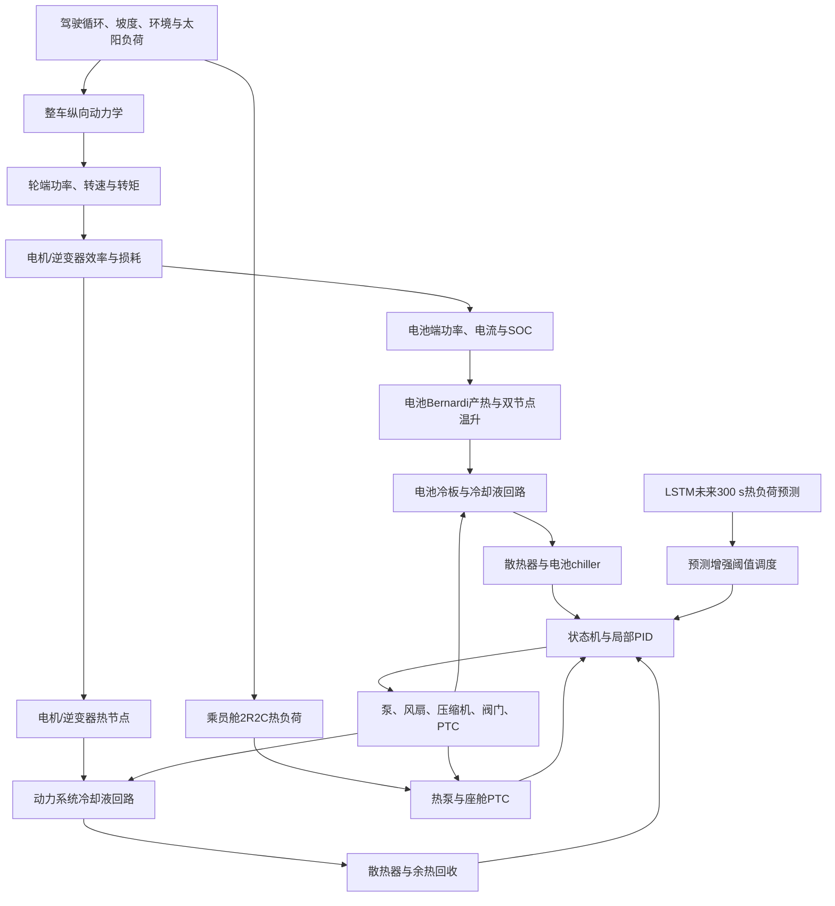

# 融合数据驱动热负荷预测的纯电动汽车整车集成热管理系统建模与能量优化研究报告

## 摘要

纯电动汽车的动力电池、电机、逆变器和乘员舱具有不同的热负荷来源、目标温度和动态响应特性。传统分散式热管理方法通常针对单一部件设置固定温度阈值，难以充分利用电驱余热，也难以根据未来驾驶负荷提前安排冷却和加热。与此同时，完全依赖人工智能直接控制泵、风扇、压缩机和阀门，又存在训练数据依赖强、约束难以解释以及故障降级不明确的问题。

本研究建立了一套面向纯电动汽车的整车集成能量与热管理动态仿真平台。模型由整车纵向动力学、电机与逆变器损耗、电池等效电路与双节点热模型、乘员舱2R2C热模型、温度相关冷却液物性、管路压降、水泵工作点、冷板对流换热、散热器与液液换热器、准稳态热泵、电池chiller、PTC加热及动力系统余热回收等部分组成。控制系统采用上层状态机和下层局部PID，并增加执行器一阶动态，以保证控制逻辑可解释、执行器状态有界且具备工程可实现性。

在数据驱动部分，使用整车物理模型生成多环境、多驾驶循环和多初始状态仿真episode。构建编码器-解码器LSTM，以过去300 s的车辆运行与热状态预测未来300 s的电池产热、电驱余热和乘员舱净热负荷。AI预测结果不直接控制执行器，而是通过有限幅度调整电池冷却启用温度、强化冷却阈值和余热回收门槛，为传统规则控制增加前瞻信息。历史不足、预测非有限、维度错误或超出工程范围时，系统确定性回退至基准策略。

正式训练采用24个独立episode，每个1200 s，采样周期为5 s。液路网络升级并重新生成数据后，最终LSTM对电池产热、电驱余热和座舱净热负荷的测试集R²分别为0.476、0.546和0.968，MAE分别为439.63 W、438.55 W和190.56 W。预测增强策略在激烈驾驶、坡道高负荷和高速高温工况下分别降低电池峰值温度0.903 °C、0.735 °C和0.234 °C。六工况等权平均电池峰值降低0.312 °C，电机峰值降低2.171 °C，百公里电耗增加0.0970 kWh/100km，座舱舒适RMSE变化约0.00072 °C。进一步完成了电池热参数辨识、三种液路架构比较、快充到站预热以及温度—充电时间—相对老化联合优化。结果表明，热安全裕度、附件能耗、充电效率与老化必须联合权衡。

**关键词：** 纯电动汽车；整车热管理；电池热模型；冷却回路；热泵；余热回收；LSTM；热负荷预测；能量优化

---

# 1. 研究背景

## 1.1 纯电动汽车热管理的必要性

纯电动汽车将传统燃油车中的发动机热源替换为动力电池、电机、逆变器和高压附件等分布式热源。与发动机相比，这些部件的温度要求和热负荷特征差异明显：

- 动力电池对温度范围和温差较敏感，高温会加速老化，低温会增大内阻并限制充放电能力；
- 电机和逆变器在高转矩、高转速及频繁加减速工况下产生铜耗、铁耗和开关损耗；
- 乘员舱既有车身传热、太阳辐射、乘员和新风负荷，又需要满足舒适性与除霜除雾需求；
- 热泵、PTC、泵、风扇和压缩机自身消耗电能，直接影响百公里电耗和续航；
- 低温环境下热泵COP和制热能力下降，电池加热与座舱制热可能同时争夺有限电能；
- 高温环境下空气散热器温差减小，仅增加液路流量不一定能够有效排热。

因此，纯电动汽车热管理不是单纯的温度控制问题，而是多热源、多热汇、多回路和共享执行器之间的动态能量分配问题。

## 1.2 分散式热管理的局限

传统策略通常为电池、电机和座舱分别设置固定阈值。例如，电池温度超过某一值时开启水泵，进一步升高时开启风扇或压缩机；座舱温度偏离设定值时独立请求制热或制冷。这类方法结构简单、易于标定，但存在以下不足：

1. 各子系统独立决策，可能重复使用共享压缩机能力；
2. 电驱余热未被充分利用，低温时仍大量依赖PTC；
3. 控制器仅根据当前温度动作，无法在未来高负荷前提前建立冷却能力；
4. 固定阈值无法根据环境、初始温度和驾驶任务动态调整；
5. 仅看部件温度容易忽略泵、风扇、压缩机和PTC带来的能耗代价。

## 1.3 数据驱动方法的机会与风险

车辆历史电流、功率、温度、车速、环境温度和执行器状态中包含热负荷演化规律。LSTM等循环神经网络能够从时间序列中提取热惯性、周期性和负荷变化特征，为未来数分钟的热需求提供预测信息。

但是，如果AI直接输出执行器命令，会带来以下风险：

- 训练分布之外的输入可能产生不可解释动作；
- 温度、安全和执行器约束难以完整保证；
- 预测失效后的降级路径不清楚；
- 策略收益难以与物理热流路径对应；
- 容易弱化热管理研究中最重要的物理建模和能量分析。

因此，本研究采用“物理模型为主体、机器学习提供预测、规则控制执行动作”的混合架构。

## 1.4 研究问题

本项目重点回答以下问题：

1. 如何从驾驶循环建立轮端功率、电驱功率、电池电流、SOC和多部件产热之间的联系？
2. 如何在系统级仿真中体现冷却液物性、管路压降、水泵工作点和冷板换热的非线性关系？
3. 如何统一描述电池、电驱、座舱、散热器、chiller、热泵、PTC和余热回收之间的能量流？
4. 如何设计可解释的整车热管理状态机和局部PID，使多个热任务能够并行执行？
5. 如何预测未来300 s的多源热负荷，同时避免episode泄漏和标准化泄漏？
6. 预测增强策略在热安全、座舱舒适、附件能耗和续航之间存在怎样的权衡？

---

# 2. 研究目的与研究内容

## 2.1 总体研究目的

建立一套可复现、可解释、可扩展的纯电动汽车整车集成能量与热管理仿真平台，以系统级物理模型为基础，引入轻量数据驱动热负荷预测，为热管理策略开发和多工况验证提供工具。

## 2.2 具体研究目标

1. 建立整车纵向动力学模型，将驾驶循环转换为轮端力、轮端功率、电机转速和转矩；
2. 建立电机与逆变器效率、功率流、损耗和单节点温升模型；
3. 建立动力电池OCV、内阻、电流、SOC、Bernardi产热和核心-表面双节点模型；
4. 建立乘员舱空气-内饰2R2C动态热模型；
5. 建立温度相关冷却液物性、管路压降、水泵工作点和泵耗模型；
6. 建立冷板、空气散热器、液液换热器和电池chiller模型；
7. 建立准稳态热泵、独立电池PTC、座舱辅助PTC和余热回收模型；
8. 设计状态机、PID、滞环和执行器动态组成的基准热管理策略；
9. 训练LSTM预测未来300 s的电池产热、电驱余热和座舱净热负荷；
10. 基于预测结果设计提前冷却、提前预热和余热利用阈值调度；
11. 在高温、低温、高速、激烈驾驶、坡道和混合工况下比较两类策略；
12. 建立电功率和热量守恒账本，并验证预测故障下的安全降级。

## 2.3 研究范围

本项目属于整车系统级集总参数仿真，包含：

- 整车一维纵向动力学；
- 电池、电机、逆变器和座舱动态热模型；
- 冷却液流动、压降、泵、冷板、散热器和换热器；
- 热泵、PTC、chiller和余热回收；
- 规则控制、局部PID和预测增强阈值调度；
- LSTM热负荷预测；
- 多工况能量与热管理评价。

本项目不包含：

- 三维CFD或有限元网格；
- 电芯内部电化学反应机理；
- 热失控传播；
- 完整制冷剂两相瞬态模型；
- 端到端强化学习控制；
- 针对具体量产车型的实车参数标定。

---

# 3. 研究方法

## 3.1 总体建模架构



仿真采用固定时间步显式推进。每个时间步的求解顺序为：

1. 读取车速、坡度、环境温度、太阳辐射和乘员数量；
2. 计算加速度、牵引力和轮端功率；
3. 计算电机转速、效率、直流侧功率和电驱损耗；
4. 根据当前温度和预测信息计算上层热管理命令；
5. 通过执行器一阶动态得到实际泵、风扇、压缩机、chiller和PTC状态；
6. 由泵曲线与系统阻力曲线求实际冷却液流量；
7. 计算冷板、散热器、热泵、chiller和余热回收热流；
8. 汇总电驱功率和附件功率，求解电池电流、SOC与产热；
9. 更新电池、电驱、座舱和冷却液温度；
10. 记录电功率与热量守恒残差、控制状态和评价指标。

## 3.2 主要参数

### 3.2.1 仿真与车辆参数

| 参数 | 数值 | 单位 |
|---|---:|---|
| 仿真时间步 | 5 | s |
| 默认单工况时长 | 1800 | s |
| 整车质量 | 1950 | kg |
| 迎风面积 | 2.35 | m² |
| 风阻系数 | 0.27 | - |
| 滚动阻力系数 | 0.0105 | - |
| 车轮半径 | 0.34 | m |
| 主减速比 | 9.1 | - |
| 传动效率 | 0.97 | - |
| 最大驱动功率 | 180 | kW |
| 最大再生功率 | 80 | kW |

### 3.2.2 电池与控制参数

| 参数 | 数值 | 单位 |
|---|---:|---|
| 电池容量 | 75 | kWh |
| 标称电压 | 380 | V |
| 标称内阻 | 0.065 | Ω |
| 核心热容 | 380000 | J/K |
| 表面热容 | 95000 | J/K |
| 核心-表面导热系数 | 380 | W/K |
| 初始SOC | 0.85 | - |
| 电池一般冷却阈值 | 34 | °C |
| 电池强化冷却阈值 | 39 | °C |
| 电池加热阈值 | 12 | °C |
| 电机冷却阈值 | 70 | °C |
| 逆变器冷却阈值 | 65 | °C |
| 座舱设定温度 | 24 | °C |

参数用于系统方法验证，不代表某一具体车型的实测标定值。

## 3.3 整车纵向动力学模型

### 3.3.1 牵引力平衡

车辆沿道路方向所需牵引力表示为：

```text
F_trac = F_inertia + F_roll + F_aero + F_grade
```

其中：

```text
F_inertia = m*a
F_roll = m*g*Crr*cos(theta)
F_aero = 0.5*rho_air*Cd*A_f*v²
F_grade = m*g*sin(theta)
```

式中，`m`为整车质量，`a`为纵向加速度，`Crr`为滚动阻力系数，`rho_air`为空气密度，`Cd`为风阻系数，`A_f`为迎风面积，`theta`为道路坡度角，`v`为车速。

轮端功率为：

```text
P_wheel = F_trac*v
```

正轮端功率表示车辆驱动，负轮端功率表示车辆减速且存在再生制动潜力。车辆静止时不计算滚动阻力功率，以避免停车阶段产生虚假能耗。

### 3.3.2 电机转速和转矩

车轮角速度和电机角速度分别为：

```text
omega_wheel = v/r_wheel
omega_motor = omega_wheel*i_final
n_motor = omega_motor*60/(2*pi)
```

电机转矩由机械功率和角速度计算：

```text
T_motor = P_wheel/omega_motor
```

低速区域对角速度设置最小数值保护，避免车速接近0时转矩数值发散。

### 3.3.3 驱动与再生功率

驱动时，直流侧需求大于机械侧功率：

```text
P_dc = P_mech/eta_drive
```

再生时，回到直流母线的功率绝对值小于机械可回收功率：

```text
P_dc = P_mech*eta_regen
```

同时施加最大驱动功率和最大回收功率限制。统一规定正功率为电池放电，负功率为电池充电。

## 3.4 电机与逆变器模型

### 3.4.1 效率模型

电机系统效率由归一化机械负荷和转速构成的解析效率面表示：

```text
lambda_P = |P_mech|/180000
lambda_n = |n_motor|/14000
```

效率近似为：

```text
eta = 0.965
    - 0.07*(lambda_P-0.65)²
    - 0.05*(lambda_n-0.55)²
    - 0.04*exp(-8*lambda_P)
```

效率被限制在0.78至0.97之间。该效率面用于保留典型“中高负荷效率较高、低负荷效率下降”的规律，后续可由台架二维效率图替换。

### 3.4.2 损耗分配

驱动工况总损耗：

```text
Q_loss = P_dc - P_mech
```

再生工况总损耗取机械功率与直流回收功率之差的绝对值。系统将总损耗按72%和28%分配给电机和逆变器：

```text
Q_motor_loss = 0.72*Q_loss
Q_inverter_loss = 0.28*Q_loss
```

该比例为系统级工程假设，具体车型应根据铜耗、铁耗、机械损耗和逆变器开关损耗数据标定。

### 3.4.3 温升模型

电机和逆变器分别采用单热容节点：

```text
C_motor*dT_motor/dt
= Q_motor_loss - UA_motor*(T_motor-T_coolant)

C_inv*dT_inv/dt
= Q_inv_loss - UA_inv*(T_inv-T_coolant)
```

电机热容为85000 J/K，逆变器热容为28000 J/K。动力冷却液只接收部件实际通过对流传出的热量，不直接接收全部损耗，从而避免部件储热与冷却液得热重复计算。

## 3.5 动力电池电气模型

### 3.5.1 开路电压

SOC被限制在0.02至0.98的经验适用区间，电池包开路电压表示为：

```text
OCV = U_nominal*(0.88 + 0.20*SOC - 0.04*SOC²)
```

该函数用于系统级能量研究，能够体现SOC变化对电压的基本影响。

### 3.5.2 温度与SOC相关内阻

电池内阻模型为：

```text
R = R_nominal*f_T*f_SOC
f_T = exp[clip(0.018*(25-T), -0.5, 1.2)]
```

低温使内阻指数增加；低SOC区域使用附加修正提高内阻。经验修正被限制在合理范围内，避免模型在极端温度和SOC下无限外推。

### 3.5.3 功率到电流求解

端电压和端功率满足：

```text
U_terminal = OCV - I*R
P_terminal = U_terminal*I
```

因此：

```text
R*I² - OCV*I + P_terminal = 0
```

选择低电流根：

```text
I = [OCV - sqrt(OCV²-4RP)]/(2R)
```

放电前根据最大放电功率和 `OCV²/(4R)` 限制请求功率，充电时限制最大回收功率，确保判别式非负。最大放电和充电功率分别为200 kW和100 kW。

### 3.5.4 SOC更新

电池包等效容量为：

```text
C_Ah = E_capacity/U_nominal
```

SOC使用库仑积分：

```text
dSOC/dt = -I/(3600*C_Ah)
```

放电电流为正，因此放电时SOC下降；再生电流为负，因此SOC上升。

## 3.6 动力电池产热与双节点热模型

### 3.6.1 Bernardi产热

电池总产热由不可逆热和可逆熵热组成：

```text
Q_battery = I²R - I*T*dOCV/dT
```

其中 `I²R` 为不可逆欧姆热，`-I*T*dOCV/dT` 为可逆热。本模型使用包级熵系数-0.035 V/K。由于可逆热与电流方向相关，在部分低电流或回收时段，瞬时总热量可能出现负值，这不一定是计算错误。

### 3.6.2 核心-表面双节点

为描述电池内部产热到表面散热的热滞后，将电池划分为核心和表面两个节点：

```text
C_core*dT_core/dt
= Q_battery - G_cs*(T_core-T_surface)
```

```text
C_surface*dT_surface/dt
= G_cs*(T_core-T_surface)
 - Q_coldplate + Q_external_heater
```

其中：

- `C_core=380000 J/K`；
- `C_surface=95000 J/K`；
- `G_cs=380 W/K`；
- `Q_coldplate`为表面到冷却液热流；
- `Q_external_heater`为电池PTC或加热液路输入热量。

将外部加热加入表面节点，是因为实际加热通常从包体、加热膜或冷却液边界进入，而不是直接作用于电化学核心。

## 3.7 冷却液热物性模型

采用50/50水-乙二醇混合液的系统级经验关联式，适用温度限制为-30 °C至100 °C：

```text
rho = 1068 - 0.52*(T-20)
cp = 3440 + 3.2*(T-20)
mu = 0.0042*exp[-0.032*(T-20)]
k = 0.385 + 0.00045*(T-20)
Pr = cp*mu/k
```

低温时黏度显著增加，会提高液路压降并改变泵工作点和对流换热。该模型用于系统仿真，不用于冷却液配方或冰点认证。

## 3.8 管路压降模型

### 3.8.1 流速与Reynolds数

```text
u = m_dot/(rho*A_flow)
Re = rho*u*D_h/mu
```

### 3.8.2 摩擦因子

层流区域：

```text
f = 64/Re
```

湍流区域使用Swamee-Jain显式近似：

```text
f = 0.25/
    {log10[e/(3.7D)+5.74/Re^0.9]}²
```

### 3.8.3 总压降

```text
DeltaP = [f*L/D + sum(K)]*rho*u²/2
```

总压降包括直管摩擦和弯头、阀门、冷板、散热器、换热器等局部阻力。

## 3.9 水泵模型

水泵最大质量流量为0.45 kg/s，额定停流压升为85 kPa，标称效率为0.52。泵转速归一化为 `n` 后，依据相似定律：

```text
DeltaP_shutoff(n) = DeltaP_shutoff,nom*n²
m_dot_zero_head(n) = m_dot_max*n
```

泵扬程曲线近似为：

```text
DeltaP_pump
= DeltaP_shutoff(n)*[1-(m_dot/m_dot_zero_head)²]
```

系统阻力曲线为：

```text
DeltaP_system = K_system*m_dot²
```

使用数值求根方法求两条曲线交点，得到实际质量流量和压升。泵功为：

```text
P_hydraulic = DeltaP*m_dot/rho
P_pump = P_hydraulic/eta_pump
```

泵效率在偏离最佳流量点时下降，并设置最低经验效率，避免在停流附近产生不合理功率。

## 3.10 电池冷板模型

冷板默认包含12条并联流道，水力直径3.5 mm，单流道面积 `8×10^-6 m²`，流道长度0.7 m，换热面积1.8 m²，壁面热阻0.002 K/W。

每条流道流量为总流量除以流道数。根据Re判断流动区域：

- 层流时使用充分发展定热流边界近似 `Nu=4.36`；
- 湍流时使用Gnielinski关联式。

对流换热系数：

```text
h = Nu*k/D_h
```

冷板总传热系数：

```text
R_conv = 1/(h*A_ht)
UA = 1/(R_wall + R_conv)
```

冷却液热容量率：

```text
C_dot = m_dot*cp
```

将电池表面视为近似恒温热源，冷板有效度为：

```text
epsilon = 1-exp(-UA/C_dot)
```

换热量与出口温度：

```text
Q_coldplate = epsilon*C_dot*(T_surface-T_coolant,in)
T_coolant,out = T_coolant,in + Q_coldplate/C_dot
```

模型同时计算冷板压降，从而能够分析提高流量带来的换热增益与泵耗代价。

## 3.11 散热器与液液换热器模型

散热器和液液换热器采用epsilon-NTU方法。热、冷侧热容量率为：

```text
C_h = m_dot_h*cp_h
C_c = m_dot_c*cp_c
C_min = min(C_h,C_c)
C_max = max(C_h,C_c)
C_r = C_min/C_max
NTU = UA/C_min
```

逆流换热器有效度：

```text
epsilon
= [1-exp(-NTU*(1-C_r))]
  /[1-C_r*exp(-NTU*(1-C_r))]
```

当 `C_r` 接近1时使用：

```text
epsilon = NTU/(1+NTU)
```

换热量：

```text
Q = epsilon*C_min*(T_hot,in-T_cold,in)
```

散热器空气侧质量流量由基础自然风、车速迎风和风扇共同决定：

```text
m_dot_air = 0.12 + 0.035*v_vehicle + 0.85*u_fan
```

风扇功率按近似立方关系计算：

```text
P_fan = P_fan,max*u_fan³
```

这能够体现低速工况对风扇的依赖和高速迎风带来的被动散热能力。

## 3.12 电池chiller模型

高温环境下，空气散热器可能无法将冷却液温度降至环境以下，因此电池液路增加制冷剂chiller。chiller从电池冷却液吸热，热量由热泵/制冷系统排向高温侧。

控制逻辑优先使用低能耗空气散热器；当环境温度较高或电池进入强化冷却时，增加chiller请求。chiller最大制冷需求为6 kW，其实际能力受压缩机共享约束和制冷COP限制。

## 3.13 乘员舱2R2C热模型

### 3.13.1 状态节点

座舱采用空气节点和内饰/车身节点：

- 空气热容：65000 J/K；
- 内饰热容：650000 J/K；
- 车身环境传热UA：110 W/K；
- 空气-内饰换热UA：180 W/K；
- 渗透风等效UA：35 W/K。

### 3.13.2 热负荷组成

车身与环境传热：

```text
Q_envelope = UA_envelope*(T_ambient-T_interior)
```

渗透风负荷：

```text
Q_infiltration = UA_infiltration*(T_ambient-T_air)
```

太阳得热：

```text
Q_solar = I_solar*A_solar*alpha_solar
```

太阳有效面积为3.2 m²，吸收率为0.55。太阳得热的65%进入内饰节点，35%直接进入空气节点。乘员显热为每人90 W。

空气与内饰换热：

```text
Q_interior-air = UA_air-interior*(T_interior-T_air)
```

### 3.13.3 动态方程

```text
C_interior*dT_interior/dt
= Q_envelope + 0.65*Q_solar - Q_interior-air
```

```text
C_air*dT_air/dt
= Q_infiltration + 0.35*Q_solar
 + Q_occupant + Q_interior-air + Q_HVAC
```

该模型可反映空气温度响应较快、内饰温度响应较慢的热惯性差异。

## 3.14 准稳态热泵模型

### 3.14.1 建模选择

本研究不求解制冷剂压力、焓值、两相流动和膨胀阀动态，而采用准稳态系统级模型。原因是研究目标为整车能量与热管理，且缺少具体压缩机图谱和制冷剂换热器台架数据。

### 3.14.2 制热COP

制热时定义近似冷热端绝对温度：

```text
T_hot = T_sink + 273.15 + 5
T_cold = T_ambient + 273.15 - 3
```

Carnot制热COP：

```text
COP_Carnot,heat = T_hot/(T_hot-T_cold)
```

实际COP：

```text
COP_heat
= clip(eta_Carnot*COP_Carnot,heat*f_frost, 1.0, 4.5)
```

Carnot效率为0.42。环境低于2 °C时考虑结霜退化，低于-10 °C时进一步降低。最大制热量为7 kW，并随环境温度降低而衰减，最低保留45%额定能力。

### 3.14.3 制冷COP

制冷模式根据蒸发端和冷凝端温度计算Carnot制冷COP，并限制在1.2至4.2之间。最大制冷量为6.5 kW。

热泵电功率满足：

```text
P_compressor = |Q_thermal|/COP
```

## 3.15 PTC加热模型

PTC热量为：

```text
Q_PTC = eta_PTC*P_PTC
```

电热效率取0.97。系统具有两条独立PTC路径：

1. 电池PTC，通过电池表面或加热液路向电池输入热量；
2. 座舱辅助PTC，在极寒条件下补偿热泵能力不足。

低温预热模式下，电池PTC、座舱热泵和座舱PTC可以并行工作。这样避免了单纯优先电池加热导致座舱长期无法升温的问题。

## 3.16 动力系统余热回收

电驱损耗不会全部立即成为可用余热。只有电机和逆变器通过对流传递到动力冷却液的热量，才可被余热回收支路利用。

当满足以下条件时打开余热回收：

- 座舱存在制热需求；
- 可用电驱余热高于门槛；
- 动力系统冷却液与座舱加热侧存在可用温差；
- 不影响电驱本身的温度安全。

回收热量受可用余热和座舱热需求两者较小值限制。预测策略可根据未来座舱负荷降低余热回收启用门槛，但不能凭空产生余热。

## 3.17 共享压缩机能力分配

座舱制冷/制热和电池chiller共享压缩机能力。分别计算座舱请求 `u_cabin` 和电池请求 `u_chiller`，若二者之和超过1，则按比例缩放：

```text
s = 1/max(u_cabin+u_chiller, 1)
u_cabin,actual = s*u_cabin
u_chiller,actual = s*u_chiller
```

该方法避免将同一台压缩机重复计算为两个满功率设备。缩放后的请求分别用于计算座舱热量、电池chiller热量和对应电功率。

## 3.18 基准热管理控制策略

### 3.18.1 分层控制结构

基准策略由两层组成：

- 上层状态机决定热管理模式、回路连接和热源优先级；
- 下层PID根据温度偏差生成连续执行器请求。

状态机包含以下模式：

1. `standby`：无明显热需求，泵以小流量维持循环；
2. `battery_warmup`：电池低于加热阈值，启动电池PTC，并允许座舱并行制热；
3. `cabin_heating`：座舱需要制热且余热不足，使用热泵和必要的座舱PTC；
4. `waste_heat_recovery`：座舱需要制热且电驱余热充足，优先回收余热；
5. `cooling`：电池或电驱超过一般冷却阈值，调节泵、风扇和必要的chiller；
6. `high_cooling`：电池超过强化冷却阈值，提升泵、风扇和chiller优先级；
7. `cabin_cooling`：座舱温度高于设定值，使用热泵制冷。

### 3.18.2 温度滞环

电池一般冷却阈值为34 °C。当温度超过阈值后冷却状态锁存，只有温度下降到阈值以下2 °C才解除。滞环用于避免在临界温度附近频繁切换模式。

### 3.18.3 PID控制

离散PID形式为：

```text
e(k) = r(k)-y(k)
u*(k) = Kp*e(k) + Ki*sum[e*dt] + Kd*de/dt
u(k) = clip(u*, u_min, u_max)
```

电池冷却PID参数为 `Kp=0.12`、`Ki=0.004`；动力系统冷却PID为 `Kp=0.07`、`Ki=0.002`；座舱PID为 `Kp=0.20`、`Ki=0.003`。本项目未使用微分增益，以减少离散工况噪声放大。

采用条件积分抗饱和：当输出已经达到上限且误差继续推动输出增大时，暂停积分；下限同理。积分量同时设置边界。

### 3.18.4 执行器一阶动态

控制器输出为目标命令，实际执行器采用一阶惯性：

```text
dx/dt = (u-x)/tau
```

精确离散形式：

```text
x(k+1)
= x(k) + [1-exp(-dt/tau)]*[u(k)-x(k)]
```

泵、风扇、PTC、座舱压缩机和电池chiller使用不同时间常数。该处理能够避免5 s采样下执行器瞬时从0跳到1，并使冷却液流量和制冷量曲线更接近工程响应。

## 3.19 LSTM热负荷预测模型

### 3.19.1 预测任务定义

采样周期为5 s：

- 历史窗口：300 s，共60步；
- 预测窗口：300 s，共60步；
- 输入维度：11；
- 输出维度：3。

输入特征包括：

1. 车速；
2. 环境温度；
3. 电池核心温度；
4. 电机温度；
5. 座舱温度；
6. 电池功率；
7. 电池泵实际状态；
8. episode内时间；
9. 历史电池产热；
10. 历史电驱余热；
11. 历史座舱净热负荷。

输出目标为未来60步的：

- 电池产热，单位W；
- 电驱余热，单位W；
- 座舱净热负荷，单位W。

历史热负荷截止当前时刻，预测目标从下一采样点开始，因此不存在未来标签泄漏。

### 3.19.2 数据生成

训练数据由整车物理仿真生成，覆盖：

- 城市、高速、混合、激烈驾驶和坡道高负荷；
- -20 °C至40 °C环境；
- 不同太阳辐射；
- 不同初始电池和座舱温度；
- 不同初始SOC；
- 车速尺度、环境偏移和初始温度扰动；
- 泵、风扇、热泵、chiller、PTC和余热回收的不同运行状态。

正式数据包含24个episode，每个1200 s。

### 3.19.3 数据集划分与标准化

采用episode级划分，而不是窗口级随机划分：

- 约60% episode用于训练；
- 约20%用于验证；
- 剩余episode用于测试。

先划分episode，再在每个episode内部生成滑动窗口。任何窗口都不能跨越episode边界，训练、验证和测试episode ID互不重叠。

输入特征和输出目标分别使用StandardScaler。两个标准化器只在训练episode上拟合，验证集和测试集只执行transform，避免测试分布信息泄漏。

### 3.19.4 网络结构

模型为编码器-解码器LSTM：

- 编码器：2层LSTM；
- 隐藏维度：48；
- 解码器：2层LSTM；
- 输出头：线性层-ReLU-线性层；
- 输出序列长度：60；
- 输出通道数：3。

编码器将历史序列压缩为上下文状态。解码器每一步接收上一时刻三目标预测和编码上下文。第一步不从零开始，而是使用最后一个历史热负荷状态。

采用残差输出：

```text
y_hat(k+1) = y_previous + 0.2*f_decoder(h_k)
```

该设计以热负荷持久性为基线，让模型重点学习未来变化，而不是同时学习绝对水平和动态变化。

### 3.19.5 训练方法

| 训练参数 | 数值 |
|---|---:|
| 优化器 | AdamW |
| 学习率 | 0.001 |
| 权重衰减 | `1×10^-5` |
| 批量大小 | 64 |
| 最大epoch | 35 |
| 早停耐心 | 6 |
| 梯度裁剪范数 | 1.0 |
| 随机种子 | 42 |

损失函数为标准化空间内的均方误差。训练初期teacher forcing比例最高约0.5，随epoch线性下降；验证和测试时完全使用模型自身预测。训练过程中保存验证损失最低的权重，最终模型最佳epoch为35。

### 3.19.6 预测评价指标

每个目标分别计算：

```text
MAE = mean(|y_hat-y|)
RMSE = sqrt(mean[(y_hat-y)²])
R² = 1 - sum[(y_hat-y)²]/sum[(y-y_mean)²]
```

除整体目标指标外，还计算60 s、180 s和300 s位置的三目标平均MAE，以观察长预测时域误差累积。

## 3.20 预测增强热管理策略

### 3.20.1 基本原则

LSTM不直接输出泵、风扇、压缩机或阀门命令。预测层只提取未来负荷摘要：

- 电池产热峰值；
- 电驱余热平均值；
- 座舱净负荷平均值；
- 预测有效性及失效原因。

### 3.20.2 电池冷却阈值调度

定义未来电池热负荷严重度：

```text
s_heat = clip[(Q_bat,peak-500)/3500, 0, 1]
```

一般冷却阈值调整为：

```text
T_cool,on,pred
= max(28, T_cool,on,base - 6*s_heat)
```

强化冷却阈值调整为：

```text
T_high,pred
= max(36, T_high,base - 2*s_heat)
```

即使预测热负荷很高，一般冷却阈值最低为28 °C，强化冷却阈值最低为36 °C，防止过度预冷。

### 3.20.3 余热回收门槛调度

当预测座舱平均热负荷超过1000 W时，余热回收启用门槛从1200 W有限降低，最低不低于700 W，使系统能够更早利用电驱余热。

### 3.20.4 预测故障降级

以下情况视为预测无效：

- 车辆启动后历史不足300 s；
- 模型或标准化器文件缺失；
- 输入维度错误；
- 输出包含NaN或Inf；
- 输出形状不是60×3；
- 预测绝对值超出100 kW工程范围。

预测无效时，阈值恢复为不可变的原始基准值，PID内部状态和模式滞环保持连续。该设计确保AI失效不会破坏底层温度保护。

## 3.21 仿真工况

| 工况 | 驾驶模式 | 基准环境 | 初始电池 | 初始座舱 | 太阳辐射 |
|---|---|---:|---:|---:|---:|
| 城市高温 | 城市启停 | 40 °C | 38 °C | 37 °C | 750 W/m² |
| 低温启动 | 城市 | -20 °C | -18 °C | -15 °C | 100 W/m² |
| 高速高温 | 高速 | 38 °C | 35 °C | 34 °C | 650 W/m² |
| 激烈驾驶 | 高频加减速 | 30 °C | 30 °C | 28 °C | 450 W/m² |
| 坡道高负荷 | 4.5°左右坡道 | 25 °C | 27 °C | 24 °C | 400 W/m² |
| 温和混合 | 混合循环 | 15 °C | 20 °C | 18 °C | 250 W/m² |

环境温度和太阳辐射在episode内加入缓慢周期变化。坡道工况坡度角在约3°至6°之间变化。每个正式策略工况运行1800 s。

## 3.22 评价指标

### 3.22.1 距离与能耗

```text
S = integral(v dt)/1000
```

```text
E_net = sum(P_battery,total*dt)/3.6e6
```

```text
EC_100km = 100*E_net/S
```

```text
Range_equivalent = E_battery/EC_100km*100
```

电池总功率包含电驱直流功率和泵、风扇、压缩机、chiller、PTC等附件功率。再生制动功率为负，因此净能耗能够反映回收收益。

### 3.22.2 热安全与舒适性

- 电池核心最高温度；
- 电机最高温度；
- 逆变器温度曲线；
- 座舱设定温度误差；
- 座舱舒适RMSE：

```text
RMSE_cabin
= sqrt[mean((T_cabin-T_set)²)]
```

### 3.22.3 附件与热流指标

- 泵、风扇、压缩机、chiller和PTC能耗；
- 电池与动力液路流量和压降；
- 散热器和冷板换热量；
- 热泵COP；
- 余热回收能量；
- 电池和电驱热负荷。

### 3.22.4 电功率平衡

每个时间步检查：

```text
r_e = P_battery,total
    - (P_drive,dc + P_auxiliary)
```

归一化电平衡误差：

```text
epsilon_e
= sum(|r_e|dt)/sum(|P_battery,total|dt)*100%
```

### 3.22.5 热量平衡

分别对电池、电驱、座舱、电池冷却液和动力冷却液检查：

```text
r_th,i = dE_stored,i/dt - Q_boundary,i
```

总热平衡误差使用所有子系统残差绝对值相加，再除以系统热流吞吐量。该指标用于发现丢热、重复计热和边界热流遗漏。

需要强调：极小热平衡残差证明的是离散方程内部一致，不代表模型与真实车辆之间具有同样小的误差。

---

# 4. 研究结果

## 4.1 LSTM训练结果

最终模型在测试episode上的结果如下：

| 预测目标 | MAE | RMSE | R² |
|---|---:|---:|---:|
| 电池产热 | 439.63 W | 628.47 W | 0.476 |
| 电驱余热 | 438.55 W | 550.59 W | 0.546 |
| 座舱净热负荷 | 190.56 W | 265.37 W | 0.968 |

不同预测时距的三目标平均MAE：

| 预测时距 | 平均MAE |
|---:|---:|
| 60 s | 360.68 W |
| 180 s | 409.65 W |
| 300 s | 432.97 W |

结果表明，远期误差随预测时间增加，但300 s预测没有明显发散。座舱负荷预测明显优于电池和电驱负荷，原因是座舱负荷主要受缓慢变化的环境、太阳和热惯性影响，而电池 `I²R` 产热和电驱损耗对瞬时加减速更加敏感。

## 4.2 六工况基准结果

| 工况 | 百公里电耗 | 等效续航 | 电池峰值 | 电机峰值 | 座舱RMSE |
|---|---:|---:|---:|---:|---:|
| 城市高温 | 15.732 kWh/100km | 476.73 km | 38.041 °C | 43.957 °C | 3.529 °C |
| 低温启动 | 48.639 kWh/100km | 154.20 km | -2.686 °C | -4.892 °C | 11.710 °C |
| 高速高温 | 16.526 kWh/100km | 453.82 km | 35.992 °C | 44.183 °C | 2.072 °C |
| 激烈驾驶 | 15.461 kWh/100km | 485.09 km | 33.173 °C | 46.381 °C | 0.939 °C |
| 坡道高负荷 | 57.145 kWh/100km | 131.25 km | 32.794 °C | 48.608 °C | 0.765 °C |
| 温和混合 | 12.029 kWh/100km | 623.47 km | 20.877 °C | 27.281 °C | 1.021 °C |

坡道工况电耗最高，主要由持续爬坡机械功率造成。低温启动工况的附件能耗达到约5.24 kWh，热泵、电池PTC和座舱PTC并行运行，使百公里电耗显著增加。

## 4.3 预测增强策略对比

预测增强策略相对基准策略的变化：

| 工况 | 电池峰值变化 | 电机峰值变化 | 百公里电耗变化 | 等效续航变化 | 座舱RMSE变化 |
|---|---:|---:|---:|---:|---:|
| 城市高温 | 0.000 °C | -0.001 °C | +0.0502 kWh/100km | -1.52 km | +0.0031 °C |
| 低温启动 | 0.000 °C | 0.000 °C | 0.0000 kWh/100km | 0.00 km | 0.0000 °C |
| 高速高温 | -0.234 °C | -0.024 °C | +0.2028 kWh/100km | -5.50 km | +0.0012 °C |
| 激烈驾驶 | -0.903 °C | -6.519 °C | +0.2828 kWh/100km | -8.71 km | 0.0000 °C |
| 坡道高负荷 | -0.735 °C | -6.484 °C | +0.0464 kWh/100km | -0.11 km | 0.0000 °C |
| 温和混合 | 0.000 °C | 0.000 °C | 0.0000 kWh/100km | 0.00 km | 0.0000 °C |

六工况等权平均：

- 电池峰值降低0.312 °C；
- 电机峰值降低2.171 °C；
- 百公里电耗增加0.0970 kWh/100km；
- 等效续航减少2.64 km；
- 座舱舒适RMSE增加约0.00072 °C。

结果说明预测策略主要在未来高负荷明显、且冷却系统有提前动作空间的工况中有效。温和混合和低温启动工况没有触发额外预冷，因此两类策略结果一致。

## 4.4 激烈驾驶工况分析

激烈驾驶具有频繁加速和再生制动，电池产热峰值可超过数千瓦。预测模型识别未来热负荷后，将电池一般冷却阈值有限下调，提前建立电池液路流量并分配chiller能力。

结果为：

- 电池峰值由33.173 °C降至32.270 °C；
- 电机峰值由46.381 °C降至39.862 °C；
- 百公里电耗由15.461增至15.744 kWh/100km；
- 等效续航由485.09 km降至476.38 km；
- 座舱舒适RMSE保持0.939 °C。

该工况温度收益最明显，但也产生最大预测冷却能耗代价。

## 4.5 坡道高负荷工况分析

坡道工况具有持续正牵引功率，电驱余热连续产生。预测策略提前提高动力和电池回路流量，使：

- 电池峰值降低0.735 °C；
- 电机峰值降低6.484 °C；
- 百公里电耗仅增加0.0464 kWh/100km。

与激烈驾驶相比，坡道工况的热负荷更连续，提前循环能够更充分利用散热器和冷却液热容，因此单位能耗换取的温度收益更高。

## 4.6 高速高温工况分析

高速迎风提高散热器空气流量，但38 °C环境使空气侧温差受限。预测策略增加电池chiller利用后，电池峰值降低0.234 °C，电耗增加0.2028 kWh/100km。

该结果说明高速迎风不能完全替代制冷剂冷却。当环境温度接近电池目标温度时，空气散热器即使流量较大，也难以将冷却液降至环境温度以下。

## 4.7 城市高温工况分析

城市高温工况的初始电池温度为38 °C，且该初始值就是整个工况的最大记录温度。预测控制只能影响仿真开始后的温度，无法改变已经存在的初始峰值。因此：

- 两类策略最大电池温度均为38.041 °C；
- 预测策略增加0.0502 kWh/100km电耗；
- 峰值指标没有体现预冷收益。

该结果说明预测策略不能只根据未来产热幅值提前冷却，还应考虑：

- 当前温度与预测峰值的关系；
- 峰值预计发生时间；
- 预计超温时长；
- 预冷可实现温降；
- 最小节能或安全收益门槛。

## 4.8 极寒启动结果

在-20 °C环境、初始电池-18 °C、初始座舱-15 °C条件下，热泵能力和COP明显下降。系统同时启用：

- 电池PTC；
- 座舱热泵；
- 座舱辅助PTC；
- 低流量电池循环。

30 min末：

- 座舱温度约22.6 °C；
- 电池核心温度约-2.7 °C；
- 座舱舒适RMSE为11.71 °C；
- 百公里电耗约48.64 kWh/100km；
- 等效续航约154.19 km。

较大的舒适RMSE主要来自初始-15 °C到舒适区的升温过程，而不是末端无法达到舒适温度。该工况清楚显示极寒热管理对续航的显著影响。

## 4.9 余热回收结果

温和混合工况中，基准与预测策略均回收约0.0141 kWh电驱余热。其他正式工况的余热回收量为0，原因包括：

- 高温工况座舱主要需要制冷；
- 极寒启动阶段电驱和冷却液温度较低，可用余热不足；
- 激烈和坡道工况座舱接近设定温度，没有持续制热需求。

余热回收必须同时满足“存在热源”和“存在热需求”，不能仅根据电驱损耗单独判断。

## 4.10 电热平衡结果

所有正式工况中：

- 电功率平衡误差远低于2%；
- 热量平衡误差远低于2%；
- 误差处于浮点数舍入量级；
- 未出现NaN、Inf、SOC越界或执行器越界。

极小残差表明代码中的损耗、储能和边界热流使用一致，没有明显丢热或重复计热。该结果不等价于实车预测精度，需要结合台架和实车数据进一步确认模型参数。

## 4.11 预测故障与偏置鲁棒性

### 4.11.1 无效预测

注入持续无效预测后：

- 最大温度轨迹偏差为0；
- 能量偏差为0；
- 控制系统完全复现基准策略；
- 热平衡误差仍满足要求。

说明预测层与底层安全控制之间具有确定性降级接口。

### 4.11.2 持续高热偏置

注入持续高估的电池热负荷后：

- 最大温度轨迹变化0.804 °C；
- 能量偏差4.55%；
- 系统仍满足温度和能量边界；
- 额外能耗主要来自不必要的提前泵循环和chiller运行。

这说明AI不直接控制执行器能够降低安全风险，但预测偏置仍会影响经济性。

---

# 5. 结果讨论

## 5.1 物理模型与数据模型的分工

本研究没有让LSTM直接预测部件温度或执行器命令，而是预测热负荷。这样分工的优点包括：

1. 产热预测与传热模型分离，控制策略变化后物理模型仍可使用；
2. 温度、安全和执行器约束由可解释模型处理；
3. 可以明确判断误差来自热负荷预测还是传热参数；
4. AI失效时，物理闭环和基准规则仍完整存在；
5. 预测目标具有明确物理单位，可与能量账本直接比较。

## 5.2 为什么座舱负荷预测优于电池和电驱

座舱负荷的主要影响量变化较缓慢，且2R2C模型具有明显低通特性。电池产热包含电流平方项，电驱损耗取决于瞬时功率和效率区间，因此高频成分更强。最终电池和电驱R²约0.5，说明模型能提供趋势和峰值信息，但不能替代当前温度反馈或精确功率预览。

后续若加入导航坡度、未来车速、计划充电功率和驾驶员意图等预览信息，电池和电驱热负荷预测仍有提升空间。

## 5.3 预测冷却的温度-能耗权衡

提前冷却的本质是提前消耗附件能量，换取热惯性和温度裕度。最终结果显示：

- 高热负荷工况温度改善明显；
- 温和工况不需要额外动作；
- 初始峰值主导工况可能只有能耗代价；
- 座舱舒适性可通过并行热任务和PID状态连续性保持不变。

因此，预测策略的下一步重点不应是继续降低温度，而应增加“最小收益约束”，只有预计温度、安全或寿命收益高于能耗成本时才执行预冷。

## 5.4 极寒热管理的系统意义

极寒工况说明单一热泵不能满足所有需求。电池需要预热以降低内阻和恢复功率能力，座舱需要制热与除霜，热泵又受到环境温度和结霜影响。独立电池PTC和座舱PTC能够保证温度目标，但会显著降低续航。

这一结果体现了整车集成热管理的价值：不是单独优化某个COP或某个温度，而是在有限电能下协调安全、动力性、舒适性和续航。

## 5.5 数值守恒与模型准确性的区别

项目通过独立热账本将数值残差控制在极小范围，说明代码实现满足所建立方程。但是，模型准确性还取决于：

- 电池OCV、内阻和熵系数；
- 电池核心/表面热容和导热系数；
- 电驱效率图和损耗分配；
- 管路和冷板压降；
- 散热器UA和风量；
- 座舱热容、UA和渗透风；
- 热泵COP、能力和低温退化；
- 控制阈值和执行器时间常数。

因此，本研究结果用于方法验证和相对比较，不直接代表特定量产车型。

---

# 6. 研究创新点与工程价值

## 6.1 物理建模层面

1. 将整车纵向功率、电池电气、Bernardi产热、电驱损耗和多节点热模型统一耦合；
2. 不直接将泵占空比等同于流量，而是求泵曲线与系统曲线工作点；
3. 冷板换热由Re、Pr、Nu和壁面热阻计算，能够分析流量-换热-泵耗关系；
4. 显式处理电池散热器、chiller、动力散热器和冷却液热容；
5. 显式处理座舱与电池共享压缩机能力；
6. 低温时允许热泵、电池PTC和座舱PTC并行工作；
7. 对五组热储能节点进行独立热量守恒回算。

## 6.2 控制策略层面

1. 使用状态机处理拓扑和优先级，PID处理连续需求；
2. 使用温度滞环和抗积分饱和避免模式和积分异常；
3. 使用一阶执行器动态避免瞬时流量和制冷量跳变；
4. 预测层只调整有限幅阈值，不直接控制执行器；
5. 保留不可变基准阈值和PID状态，支持确定性故障降级。

## 6.3 数据驱动层面

1. 预测三个具有物理意义的热负荷，而不是直接输出控制命令；
2. 采用episode级划分避免重叠窗口泄漏；
3. 标准化器只拟合训练episode；
4. 使用历史热负荷物理估计和残差解码提高长时预测能力；
5. 同时报告目标级和60/180/300 s时距级误差；
6. 对历史不足、非有限、越界和高热偏置进行鲁棒性验证。

## 6.4 求职与工程展示价值

项目能够体现以下能力：

- 车辆能量流与热负荷分析；
- 集总参数热模型建立；
- 冷却液流动和换热计算；
- 泵、散热器、冷板和热泵系统建模；
- 多回路与共享执行器能量分配；
- 状态机、PID和故障降级设计；
- 时间序列数据处理与LSTM训练；
- 电热守恒验证与多工况结果分析；
- 将AI限制在可解释、可验证的工程边界内。

---

# 7. 研究局限性

## 7.1 参数未针对具体车型标定

当前参数为系统级工程假设，尚未使用具体车型台架或实车CAN数据标定。绝对温度、能耗和续航结果不能直接解释为某一量产车型性能。

## 7.2 电池模型为包级等效模型

模型不包含单体间温差、模组空间分布、电化学浓差极化、老化和热失控传播。双节点模型只能描述平均核心和表面温度。

## 7.3 电驱效率面为解析近似

当前效率面保留典型趋势，但未使用实测转速-转矩二维效率图，也未分别建模铜耗、铁耗、机械损耗和逆变器开关损耗。

## 7.4 冷板模型不描述流量不均匀

冷板假设各并联流道均匀分配流量，不考虑集流歧管和局部热点。后续可使用CFD或试验得到流量分配修正系数。

## 7.5 热泵为准稳态模型

模型不包含制冷剂压力、焓值、过热度、过冷度、膨胀阀和两相换热器动态。压缩机能力分配为系统级近似。

## 7.6 训练数据主要来自仿真

模型存在sim-to-real差异。真实传感器噪声、驾驶员行为、交通流和部件老化可能改变输入分布。

## 7.7 预测策略仍为规则增强

预测层使用固定映射调整阈值，尚未显式求解温度-能耗最优控制问题。其优点是可解释和安全，缺点是无法保证全局最优。

---

# 8. 后续研究方向

## 8.1 参数辨识与实车验证

- 使用HPPC或脉冲试验标定电池OCV和内阻；
- 使用加热/冷却响应试验辨识电池热容和热阻；
- 使用电驱台架图替换解析效率面；
- 使用泵和冷板台架数据标定扬程、效率、压降和UA；
- 使用环境舱和浸车试验辨识座舱2R2C参数；
- 使用热泵台架数据标定COP和能力图；
- 使用CAN数据验证SOC、温度、流量和附件功率。

## 8.2 灵敏度与不确定性分析

对内阻、热容、UA、泵阻力、COP和座舱热负荷参数进行全局灵敏度分析，给出温度和能耗结果的置信区间，而不是只报告单一参数组合。

## 8.3 引入路线预览

将导航坡度、未来车速、交通状态、快充计划和目标到达时间作为已知未来输入，提高电池和电驱热负荷的300 s预测能力。

## 8.4 预测置信度与收益门槛

为LSTM增加不确定性估计。当预测置信度低或预冷收益不足时，不调整基准阈值。可定义：

```text
预期收益 = 超温风险降低 + 老化收益 - 附件能耗成本
```

仅当预期收益为正时启用预测动作。

## 8.5 更高保真制冷回路

在获得压缩机和换热器数据后，建立基于制冷剂物性的准动态模型，计算蒸发压力、冷凝压力、过热度、压缩机转速和阀门开度，同时保持整车实时仿真能力。

## 8.6 老化与快充热管理

加入SOC、温度和倍率相关的电池老化成本，将热安全、能耗和寿命共同纳入评价；针对快充工况增加充电桩功率、充电限制和电池预冷策略。

---

# 9. 研究结论

本研究完成了纯电动汽车整车集成能量与热管理系统的系统级动态建模、控制策略设计、LSTM热负荷预测和多工况评价，主要结论如下：

1. 通过整车纵向动力学、电驱效率和电池等效电路，可以将驾驶循环完整映射为电池功率、SOC和多部件热负荷；
2. 泵工作点、温度相关冷却液物性和Re-Nu冷板模型能够体现液路流动、换热和泵耗之间的非线性关系；
3. 电池双节点、电驱热容、座舱2R2C及两套冷却液节点能够描述不同热惯性，并支持逐子系统热量守恒验证；
4. 高温环境下仅增加水泵流量不足以排热，必须配置有效空气散热器或电池chiller；
5. 极寒环境下热泵能力明显不足，电池PTC和座舱辅助PTC可以恢复温度，但会显著增加电耗；
6. 状态机、PID、滞环、抗积分饱和和执行器动态可以形成可解释、可降级的整车闭环控制；
7. LSTM能够提供未来300 s热负荷趋势，其中座舱负荷可预测性最高，电池和电驱负荷受瞬时功率影响较大；
8. 预测增强策略在激烈、坡道和高速工况中提高热安全裕度，但会增加附件能耗；
9. 六工况平均电池峰值降低0.312 °C，百公里电耗增加0.0970 kWh/100km，说明预测冷却存在明确温度-能耗权衡；
10. AI预测不直接控制执行器、预测无效时确定性回退基准策略，是保证工程可解释性和故障安全性的关键；
11. 电热守恒验证证明代码内部能量路径一致，但实车应用仍需要参数标定、模型确认和sim-to-real验证。

总体而言，本项目形成了“整车功率需求-多部件产热-热流体回路-热源分配-预测增强控制-能量与温度评价”的完整研究链路。其主要价值不在于追求复杂AI控制，而在于使用可验证的物理模型建立整车热管理主体，再用有限的预测信息提升传统策略的前瞻性。

---

# 10. 项目复现与成果文件

## 10.1 运行命令

```powershell
cd E:\EVIntegratedThermalManagement
D:\anaconda\python.exe -m pytest -q
D:\anaconda\python.exe experiments\run_all.py --quick
D:\anaconda\python.exe experiments\run_all.py
D:\anaconda\python.exe experiments\verify_artifacts.py
```

## 10.2 主要结果文件

```text
models/thermal_load_lstm.pt               最佳LSTM权重
models/feature_scaler.joblib              输入标准化器
models/target_scaler.joblib               目标标准化器
models/test_metrics.json                  正式预测指标
models/training_history.json              训练历史
results/tables/strategy_comparison.csv    六工况双策略结果
results/tables/robustness_checks.csv      故障与偏置结果
results/figures/                           训练与仿真图表
results/logs/run_manifest.json            配置哈希和运行清单
```

## 10.3 软件验证状态

- 自动化测试：以当前 `pytest` 全量回归结果为准；
- Python源码编译：通过；
- 正式策略结果：12行有限数值；
- 正式结果图：14张；
- 电功率与热量平衡：满足小于2%的验收标准；
- 无效预测降级：与基准策略逐点一致。

---

# 附录A：主要符号说明

| 符号 | 含义 | 单位 |
|---|---|---|
| `m` | 整车质量 | kg |
| `v` | 车速 | m/s |
| `a` | 加速度 | m/s² |
| `theta` | 坡度角 | rad |
| `P_wheel` | 轮端功率 | W |
| `P_dc` | 电驱直流侧功率 | W |
| `SOC` | 电池荷电状态 | - |
| `OCV` | 电池开路电压 | V |
| `I` | 电池电流，放电为正 | A |
| `R` | 电池等效内阻 | Ω |
| `Q_battery` | 电池产热 | W |
| `C_core` | 电池核心热容 | J/K |
| `G_cs` | 核心-表面导热系数 | W/K |
| `m_dot` | 冷却液质量流量 | kg/s |
| `Re` | Reynolds数 | - |
| `Pr` | Prandtl数 | - |
| `Nu` | Nusselt数 | - |
| `h` | 对流换热系数 | W/(m²·K) |
| `UA` | 总传热系数与面积乘积 | W/K |
| `epsilon` | 换热器有效度 | - |
| `NTU` | 传热单元数 | - |
| `COP` | 热泵性能系数 | - |
| `Q_HVAC` | HVAC输入座舱热量 | W |
| `u` | 归一化执行器命令 | - |

# 附录B：主要模型假设

1. 车辆只考虑纵向运动，不考虑横摆、侧倾和轮胎滑移；
2. 环境空气密度采用常数；
3. 电池采用包级等效电路，不描述单体差异；
4. 电池核心和表面节点内部温度均匀；
5. 电机和逆变器分别视为单热容节点；
6. 各冷却液回路采用集总温度节点；
7. 冷板并联流道流量均匀分配；
8. 冷却液物性只随温度变化；
9. 散热器和液液换热器使用准稳态epsilon-NTU方法；
10. 热泵使用准稳态COP和能力模型；
11. 余热回收受实际电驱到冷却液热流限制；
12. 座舱湿度、潜热和玻璃除霜过程未单独建模；
13. 执行器使用一阶惯性，不描述电机和阀门机械细节；
14. LSTM训练数据主要来自物理仿真；
15. 所有默认参数用于方法验证，实车应用前需要重新标定。

---

# 附录C：面向整车热管理岗位的升级实现

本附录对应 `final-reviewed-formal-v2`，用于说明原项目在“液路过度简化、参数未标定、充电场景缺失和优化目标单一”等方面的升级。机器可读结果分别位于 `results/calibration`、`results/architecture`、`results/charging` 和 `results/optimization`，每个目录均有独立suite manifest绑定当前plant与完整证据集。

## C.1 参数辨识、验证与不确定性分析

建立统一参数注册表，记录参数名称、单位、默认值、上下界、来源和成熟度；对电池核心热容、表面热容和核心—表面热导执行受界最小二乘辨识。训练使用4个合成episode，验证使用2个未参与拟合的holdout episode。

辨识结果为332.29 kJ/K、117.04 kJ/K和294.22 W/K；holdout综合温度RMSE由0.414 °C降至0.023 °C，改善94.3%。数值Jacobian秩为3，缩放条件数为6.44，说明在当前激励和参数范围内具有局部可辨识性。该实验属于合成隐藏真值恢复，`model_confirmation=false`，不能表述为实车参数精度。

## C.2 一维液路网络与架构比较

将固定换热系数调用升级为一维液压网络：由泵扬程曲线与冷板、散热器、管路、阀门等命名部件压降之和求工作点，再以质量流量驱动换热关联式。比较独立双回路、液液耦合双回路和共享热汇三种拓扑，共形成18行工况结果；扫描45个泵/散热器规格点，其中36个可行、9个因设计流量包络不足而不可行。

按六工况内电池峰值、电机峰值、泵能耗和附件能耗等权名次和，共享热汇在当前假设下排名第一。该排序未计入成本、布置、NVH、可靠性和供应商约束，因此只用于概念架构筛选。

## C.3 快充到站预热

增加路途中预热/预冷、到站SOC、充电功率接受、SOC/温度限流与快充终止模型，并显式闭合站端输入、DC损耗、附件功率和电池入包功率。低温到站无预热时，电池核心为-11.82 °C，充电至目标SOC需要37.58 min；规则预热将到站核心提高到10.01 °C、充电时间缩短到17.58 min，但消耗3.61 kWh预热能量且提高相对老化damage。

## C.4 温度—充电时间—老化联合优化

以预热开始时刻、目标温度和最大热功率为决策变量，以充电时间、预热能量和相对老化damage为三个目标；温度同时作为决策结果和约束，不与不同量纲目标直接裸加权。候选必须满足到站SOC、温度、充电完成、终止SOC和功率闭合约束。

共评估186个候选，先按原始目标判定非支配关系，再按1 min、0.1 kWh和`5e-6` damage的工程分辨率保留33个Pareto代表点。低温推荐策略为提前1200 s、目标15 °C、热功率上限5 kW：到站核心-1.27 °C，充电22.75 min，预热能量1.80 kWh，处于“无预热较慢”和“规则预热能耗较高”之间。环境±5 °C、到站时间±5 min和100 kW站端降额等鲁棒场景均满足约束。

## C.5 工程闭环与结论边界

quick与formal实验使用独立目录，正式结果以plant SHA-256绑定源码、配置和模型；run manifest和upgrade manifest检查哈希、行数、有限值及必要产物，验证脚本还会检查文档关键数字是否与机器结果一致。这样避免快速试跑覆盖正式CSV、权重和结论。

升级后的项目形成“需求与工况—物理建模—参数辨识—架构选型—控制—快充优化—守恒与鲁棒性验证—结果追溯”的完整链条。仍需实车/台架数据、供应商部件图和车型约束才能进入量产标定与模型确认阶段。
