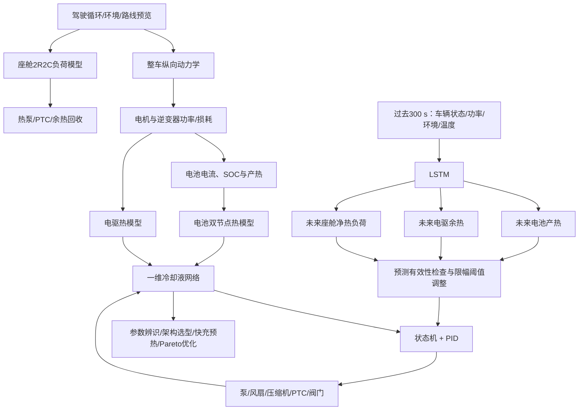

# 纯电动汽车整车集成热管理项目介绍

> 当前版本：2026-08-09正式交付版
>
> 正式运行：`final-reviewed-formal-v2`
>
> 证据边界：`data_maturity=synthetic`，`aging_claim_scope=relative strategy comparison only`
>
> 对应研究报告：[`项目研究报告.md`](项目研究报告.md)
>
> 所有数字以[`数据与结果索引.md`](数据与结果索引.md)和根目录机器结果为准

## 1. 项目名称

**融合物理模型与数据驱动预测的纯电动汽车整车集成热管理——参数辨识、液路架构、快充到站预热与多目标优化**

简历短标题可写为：

**纯电动汽车整车热管理建模、到站预热与多目标优化**

## 2. 一句话介绍

建立覆盖动力电池、电机、逆变器、座舱和冷却液网络的整车热管理仿真平台，完成热参数辨识、三种液路架构选型、LSTM热负荷预测、快充到站预热及充电时间—能耗—相对老化Pareto优化。

## 3. 项目解决什么问题

纯电动汽车的电池、电驱和座舱具有不同温度目标，却共享整车电能、压缩机、散热器和余热。高温冷却、极寒预热、座舱舒适和快充效率之间会互相影响。

本项目解决的不是“把某个部件温度降到最低”，而是：

- 从驾驶工况计算整车功率和动态热负荷；
- 建立电池、电驱、座舱和液路的能量传递关系；
- 协调泵、风扇、压缩机、PTC和阀门；
- 利用未来热负荷和导航到站信息提前建立温度条件；
- 在热安全、充电时间、能耗和老化风险之间做可解释权衡；
- 用参数辨识、独立验证和产物哈希控制结论可信度。

## 4. 系统结构

## 5. 我完成的核心工作

### 5.1 整车电—热建模

- 根据车速、加速度、坡度、滚阻和风阻计算轮端功率；
- 建立电机和逆变器效率、损耗与温升模型；
- 建立SOC/温度相关的电池等效电路和产热模型；
- 使用核心—表面双节点描述电池内部热惯性；
- 使用空气—内饰2R2C模型描述座舱负荷；
- 建立散热器、冷板、chiller、热泵、PTC和余热回收模型。

### 5.2 一维液路和架构选型

- 使用Darcy-Weisbach压降、泵曲线和系统阻力曲线交点计算实际流量；
- 输出管路、冷板、水套、散热器和阀门的pressure budget；
- 比较独立双回路、液液耦合双回路和共享热汇三种架构；
- 扫描45个泵/散热器规格点并保留不可行原因。

### 5.3 控制与预测

- 上层状态机处理预热、冷却、座舱空调、余热回收和优先级；
- 下层PID调节泵、风扇、压缩机和PTC；
- LSTM预测未来300 s的电池产热、电驱余热和座舱净热负荷；
- 预测只调整规则阈值，失效时确定性回退，不直接控制执行器。

### 5.4 参数辨识与V&V

- 建立参数注册表，统一单位、边界、来源和可信等级；
- 使用受界优化辨识电池核心热容、表面热容和内部热导；
- 分离训练episode与holdout episode；
- 输出残差、Jacobian秩、条件数、局部和全局敏感性；
- 明确区分合成真值回辨与真实模型确认。

### 5.5 快充到站预热和联合优化

- 建立路线预览、到站SOC储备和路线取消回退逻辑；
- 建立温度/SOC/电压电流/站端功率共同约束的快充接受功率；
- 建立站端—DC母线—附件—电池功率账本；
- 建立依赖温度、SOC、C-rate和Ah-throughput的相对老化指标；
- 对预热开始时间、目标温度和热功率进行Pareto优化。

## 6. 最新结果

| 研究模块 | 结果 |
|---|---|
| LSTM预测 | 电池、电驱、座舱R²分别为0.476、0.546、0.968 |
| 预测控制 | 六工况平均电池峰值-0.312 °C，电机峰值-2.171 °C，电耗+0.0970 kWh/100km |
| 参数辨识 | 合成holdout综合RMSE由0.4138 °C降至0.0234 °C，改善94.34% |
| 架构选型 | 3种架构×6工况=18组结果，45个规格点中36个可行 |
| 当前架构推荐 | 当前等权热—能耗指标下共享热汇排名第一 |
| 低温规则预热 | 充电时间由37.58 min降至17.58 min，消耗3.61 kWh |
| 联合优化 | 186个候选，各工况合计33个工程分辨率Pareto代表点（低温11、温和12、高温10） |
| 工程质量 | 61项测试通过，23项正式和44项升级产物具备哈希追溯 |

## 7. 项目的工程亮点

1. **不只做单部件模型**：从整车功率、部件产热一直追踪到热汇和附件能耗。
2. **不把控制指令当作流量**：流量由泵曲线和网络阻力闭合求解。
3. **不把机器学习当黑箱控制器**：预测增强规则，反馈和安全边界保留。
4. **不靠训练集证明标定有效**：辨识和holdout验证分离。
5. **不只追求最短快充时间**：同时展示路线能耗和相对老化代价。
6. **不混用旧结果**：正式运行、suite和文档数字均绑定同一plant SHA。

## 8. 简历写法

### 项目名称

纯电动汽车整车热管理建模、到站预热与多目标优化

### 技术栈与职责边界

- 技术栈：Python、NumPy、pandas、SciPy、PyTorch、Matplotlib、pytest、YAML、Git；
- 当前仓库覆盖的工作：需求分解、系统建模、控制与预测、实验设计、参数辨识、优化、V&V、结果可追溯和文档交付；
- 如果该项目存在团队协作，投递前应按真实分工删改“个人职责”，不要把团队成果全部写成个人完成；
- 项目起止时间应在简历中按真实经历填写，仓库本身不能证明个人参与周期。

### 推荐项目描述

- 搭建电池、电驱、座舱及一维冷却液网络的整车热管理模型，基于泵曲线—系统阻力交点求解流量，完成3种热管理架构在6类工况下的18组对比及45组泵—散热器规格扫描。
- 建立参数注册、受界辨识、holdout验证和敏感性分析流程，在合成观测方法验证中将电池双节点温度RMSE由0.414 °C降低至0.023 °C。
- 构建状态机+PID控制与LSTM热负荷预测，预测未来300 s电池产热、电驱余热和座舱负荷，并设计预测异常时的确定性规则回退。
- 建立考虑站端功率、SOC安全边界、电池温度和相对老化的快充模型；低温规则预热仿真将充电时间由37.58 min缩短至17.58 min。
- 完成温度与SOC硬约束下的充电时间—预热能耗—相对老化三目标优化，评估186个策略并提取各工况合计33个工程分辨率Pareto代表点；低温推荐点在1个名义和5个扰动案例下均可行。
- 建立正式/quick实验隔离、plant SHA和产物哈希验收流程，61项自动化测试通过。

## 9. 一分钟面试介绍

我做的项目是纯电动汽车整车集成热管理建模、到站预热和多目标优化。项目从驾驶工况出发，计算轮端功率、电机和逆变器损耗、电池SOC及产热，再建立电池、电驱、座舱和冷却液网络模型。液路不是直接给定流量，而是根据泵曲线和管路、冷板、散热器及阀门压降求实际工作点。

控制上采用状态机和PID，LSTM只预测未来300秒的电池产热、电驱余热和座舱负荷，用来提前调整控制阈值，预测失效时会回退到规则控制。之后我又完成了电池热参数辨识和独立验证，比较了三种热管理架构，并建立快充到站预热、功率账本和相对老化模型。

最终对预热开始时间、目标温度和热功率评估了186个候选，得到各工况合计33个工程分辨率Pareto代表点。这个项目的重点不是单独训练一个LSTM，而是建立从物理模型、参数、液路、控制到快充优化和V&V的完整整车热管理研究链。

## 10. 三分钟面试介绍

我的项目面向纯电动汽车整车热管理。电池、电机、逆变器和座舱的温度目标不同，但会共享电能、压缩机、散热器和余热，因此我把问题定义成系统级的温度、舒适性、能耗、快充时间和老化权衡。

第一部分是整车物理模型。我根据车速、加速度、坡度和道路阻力计算轮端功率，再通过电机、逆变器效率得到电驱损耗，并利用电池等效电路计算电流、SOC和产热。电池采用核心—表面双节点，座舱采用空气—内饰2R2C。冷却液侧建立了一维网络，泵流量由泵曲线和系统压降曲线的交点求解，每个时间步都能得到部件压降预算、泵功和流量诊断。

第二部分是控制和预测。上层状态机判断电池预热、冷却、座舱制热制冷和余热回收，下层PID控制水泵、风扇、压缩机和PTC。LSTM预测未来300秒三类热负荷，但不直接输出执行器命令，只有限幅度地提前调整规则阈值；预测无效时恢复基准控制。六工况结果显示，预测策略平均降低电池峰值0.312摄氏度和电机峰值2.171摄氏度，但百公里电耗增加0.097千瓦时，说明提前冷却本质上是在用能耗换温度裕度。

第三部分是工程深化。我建立了参数注册和受界辨识流程，用4个合成训练episode辨识电池双节点参数，再用2个未参与辨识的合成holdout episode验证，综合RMSE由0.414摄氏度降到0.023摄氏度。液路方面比较独立双回路、液液耦合和共享热汇三种架构，并扫描45个泵和散热器规格点。

最后是快充到站预热。我建立了路线SOC安全储备、温度和SOC相关充电接受功率、站端功率账本及覆盖“路线+充电”完整任务的相对老化指标。低温规则预热可以把充电时间从37.58分钟降到17.58分钟，但消耗3.61千瓦时并提高相对老化，所以我进一步做了Pareto优化。在186个候选中得到各工况合计33个工程分辨率代表点，低温推荐点充电22.75分钟、预热1.80千瓦时，位于无预热和激进预热之间。

整个项目最后通过61项测试、固定随机种子和正式运行流程支持复现，并用manifest、plant SHA和44项升级证据哈希完成一致性核验与追溯。当前参数辨识是合成数据方法验证，老化也是相对指标，我不会把它包装成实车标定结果。

## 11. 面试时必须主动说明的边界

- 参数辨识数据是合成观测，不是实车CAN或台架数据；
- 94.34%是合成holdout上的RMSE改善，不是量产车型精度；
- 老化damage只支持同条件策略相对比较；
- 共享热汇排名只适用于当前热—能耗指标；
- 规则预热缩短的是仿真充电时间；
- LSTM提供预测信息，安全控制仍由物理模型、状态机和PID负责。

主动说明这些边界不会削弱项目，反而能体现对模型验证、标定和工程责任的理解。
