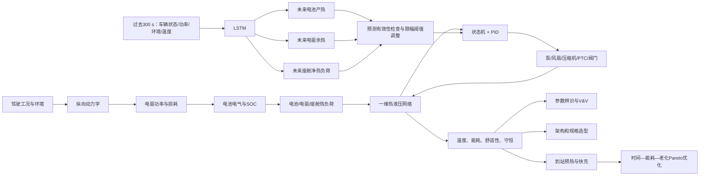

# 融合物理模型与数据驱动预测的纯电动汽车整车集成热管理研究

## ——参数辨识、液路架构、快充到站预热与多目标优化

> 报告版本：2026-08-09正式交付版
>
> 正式运行：`final-reviewed-formal-v2`
>
> plant SHA-256：`d3c0ea7429cd7292d88f2a46f2d4b42a63108c5de92c9bd1e7527affce68525f`
>
> 研究成熟度：系统级仿真与方法验证；尚未完成特定车型实车模型确认

## 摘要

纯电动汽车的动力电池、电机、逆变器和乘员舱具有不同的温度目标与动态热负荷，同时共享整车电能、散热器、压缩机能力和可回收余热。只针对单一部件追求最低温度，可能增加附件能耗、削弱续航，甚至把热负荷转移给其他子系统。为此，本项目建立一套面向整车热管理岗位能力要求的系统级研究平台，贯通驾驶工况、纵向动力学、电驱损耗、电池电热状态、座舱负荷、冷却液网络、控制策略、热负荷预测、参数辨识、架构选型、快充到站预热和多目标优化。

基础模型从车速、加速度、道路坡度和环境条件出发，计算轮端需求、电机与逆变器损耗、电池电流、SOC和产热。电池采用等效电路与核心—表面双节点热模型，座舱采用空气—内饰2R2C模型，冷却液系统采用基于Darcy-Weisbach压降、泵曲线工作点和epsilon-NTU换热器的一维热液压网络。控制系统由上层状态机、下层PID和执行器一阶动态构成；LSTM只预测未来300 s的电池产热、电驱余热和座舱净热负荷，用于有限幅度地调整规则控制阈值，不直接控制执行器。

在此基础上，项目增加参数注册、受界参数辨识、未参与辨识的合成holdout验证和敏感性分析；比较独立双回路、液液耦合双回路和共享热汇三种架构；建立考虑站端功率、充电接受能力、SOC安全边界、热管理附件和相对老化的快充模型；最后以预热开始时间、目标温度和最大热功率为决策变量，在温度与SOC硬约束下开展充电时间—预热能耗—相对老化三目标优化。

正式结果显示：LSTM对电池产热、电驱余热和座舱净热负荷的测试集R²分别为0.476、0.546和0.968；预测增强控制在六工况下平均降低电池峰值0.312 °C和电机峰值2.171 °C，但百公里电耗增加0.0970 kWh/100km，体现出温度裕度与能耗的明确权衡。合成真值回辨中，电池双节点参数在未参与辨识的合成holdout episode上，综合RMSE由0.4138 °C降至0.0234 °C。三架构六工况形成18组结果，45个部件规格点中36个可行；当前等权指标下共享热汇排名第一。低温到站无预热与规则预热的充电时间分别为37.58 min和17.58 min，但规则预热消耗3.61 kWh并提高相对老化指标。联合优化评估186个可行候选，经原始非支配判断和工程分辨率筛选后，各工况合计得到33个Pareto代表点（低温11、温和12、高温10）；低温推荐策略将预热能耗控制为1.80 kWh、充电时间为22.75 min，并在1个名义和5个扰动案例下验证可行。

本研究的贡献不在于宣称某一控制器或架构绝对最优，而在于建立一条可解释、可复现、能暴露约束与证据成熟度的整车热管理研究链。当前辨识数据为合成观测，老化模型为相对策略指标，所有绝对数值在面向具体车型应用前仍需使用供应商性能图、台架数据和实车CAN数据重新标定与独立确认。

**关键词：** 纯电动汽车；整车热管理；热液压网络；参数辨识；LSTM；到站预热；快充；电池老化；Pareto优化

---

# 1 研究背景与问题定义

## 1.1 整车热管理为什么是系统问题

纯电动汽车中至少存在四类关键热对象：

1. 动力电池对低温充电、高温安全和温差高度敏感；
2. 电机和逆变器具有高功率密度，温度影响效率、绝缘寿命和功率降额；
3. 乘员舱要求快速达到舒适区，但压缩机、热泵和PTC会直接消耗电池能量；
4. 冷却液、冷媒、散热器、chiller、泵、风扇和阀门构成共享资源网络。

各子系统并非独立。电池高温可能抢占压缩机制冷能力，极寒时电池预热和座舱制热会同时增加附件负荷，电驱余热既可以被散热器排出，也可以被座舱利用。由此，整车热管理的合理目标不是“所有温度尽可能低”，而是在安全边界内协调热安全、舒适性、快充时间、附件能耗、续航和老化风险。

## 1.2 原始项目的不足

原始项目已经具备物理模型、状态机、PID和LSTM热负荷预测，但仍存在四个影响工程完整性的缺口：

- 物理参数缺少统一来源、边界和可辨识性管理；
- 液路更接近等效固定阻力，难以用于部件压降预算和架构选型；
- 缺少快充到站预热这一典型量产功能场景；
- 优化目标集中在温度和能耗，没有显式处理充电时间与老化权衡。

另外，快速运行曾可能覆盖正式数据，使报告、模型权重和图表出现版本漂移。升级工作首先修复产物治理，再逐层增加建模深度。

## 1.3 研究问题

本项目围绕以下问题展开：

1. 如何从驾驶循环建立闭合的整车电—热—流体能量路径？
2. 如何让热负荷预测增强传统控制，同时保留安全降级能力？
3. 如何判断参数是否可辨识，并区分代码验证、参数回辨和真实模型确认？
4. 如何用部件级液压网络比较不同整车热管理架构？
5. 如何在到站前利用路线预览调节电池温度，同时保障SOC储备？
6. 如何联合权衡充电时间、预热能耗和相对老化，而不是只追求最短时间？
7. 如何让所有结论都能追溯到唯一代码版本和机器结果？

## 1.4 研究目标

- 建立电池、电驱、座舱和液路的一体化系统模型；
- 建立可解释、可降级的预测增强控制；
- 建立参数注册、辨识、holdout V&V和敏感性流程；
- 建立三种热管理拓扑及泵—散热器规格包络；
- 建立到站预热、快充接受功率、功率账本和相对老化模型；
- 构建温度与SOC硬约束优先的充电时间—预热能耗—相对老化三目标Pareto优化；
- 建立正式/快速实验隔离及产物哈希证据链。

## 1.5 研究边界

该项目是系统级集总参数仿真，不是：

- 三维电池包CFD；
- 冷媒两相瞬态或压缩机详细机理模型；
- 已完成供应商数据标定的量产控制软件；
- 已由台架或实车独立确认的数字孪生；
- 可以预测容量衰减百分比或寿命里程的SOH模型。

---

# 2 总体技术路线

## 2.1 系统信息流



## 2.2 模型和证据分层

项目采用五层结构：

1. **物理层**：动力学、电气、热、流体和换热方程；
2. **控制层**：状态机、PID、执行器动态及故障回退；
3. **预测层**：LSTM热负荷序列预测；
4. **工程决策层**：参数辨识、架构排名、快充预热和Pareto推荐；
5. **证据层**：独立运行目录、plant SHA、manifest、哈希和自动验收。

物理模型始终承担状态推进和安全约束；机器学习只提供前瞻信息。这样即使预测缺失或偏置，底层热管理仍能按规则运行。

---

# 3 整车物理模型

## 3.1 纵向动力学

车辆牵引力由惯性、滚动、空气和坡度阻力组成：

```text
F_req = m*a + m*g*C_rr*cos(theta)
        + 0.5*rho_air*C_d*A_f*v^2 + m*g*sin(theta)
P_wheel = F_req*v
```

驱动时，轮端功率经传动、电机和逆变器效率折算到电池侧；制动时考虑再生效率和最大回收功率。该层把驾驶循环转换为电机转速、转矩和电池功率需求。

## 3.2 电机和逆变器

电驱效率由转速和负荷的解析效率面近似。输入与输出功率之差形成损耗：

```text
P_loss,motor = P_electrical,motor - P_mechanical
P_loss,inverter = P_dc - P_ac
```

电机和逆变器分别具有热容节点，损耗一部分形成部件储热，另一部分经水套传给动力冷却液。这样可以区分瞬时损耗和温度响应，不把功率损失直接等同于同一时刻的散热量。

## 3.3 动力电池电气模型

电池包使用开路电压与内阻等效模型。放电功率约束满足：

```text
P_terminal = U_oc*I - I^2*R
SOC(k+1) = SOC(k) - I*dt/Q_nominal
```

开路电压和内阻随SOC、温度变化。求解电流时检查判别式、电流上限、端电压和功率可行性；再生或充电时采用统一符号约定进入电池模型。

## 3.4 电池双节点热模型

电池采用核心和表面两个温度状态：

```text
C_core*dT_core/dt = Q_gen - G_cs*(T_core-T_surface)
C_surface*dT_surface/dt = G_cs*(T_core-T_surface)
                         - UA_coolant*(T_surface-T_coolant)
                         + Q_external
```

产热包含以欧姆热为主的Bernardi形式。核心节点描述内部产热和热惯性，表面节点描述内部导热、冷板冷却和外部PTC加热。与单节点模型相比，该结构可以表达核心温度滞后和表面快速响应，同时保持整车仿真所需的计算效率。

## 3.5 座舱2R2C模型

座舱分为空气和内饰两个节点。热负荷包括：

- 车身与环境传热；
- 空气渗透；
- 太阳辐射；
- 乘员显热；
- 内饰与空气之间的蓄放热；
- HVAC制热或制冷。

空气节点响应较快，内饰节点体现热惯性。舒适性用空气温度相对设定值的RMSE等指标评价。

## 3.6 一维液压网络

电池和电驱回路由命名部件组成：供回水管、局部阻力、冷板或水套、散热器芯体和路由阀。每一时刻的流量由泵曲线与系统压降曲线交点决定：

```text
DeltaP_pump(n, m_dot) = sum_i DeltaP_i(m_dot, rho, mu, valve_i)
```

管路采用Darcy-Weisbach：

```text
DeltaP_pipe = f*(L/D)*(rho*v^2/2)
Re = rho*v*D/mu
```

局部部件采用可追溯的二次阻力。求解输出质量流量、泵压升、部件pressure budget、效率、泵功、闭合残差和状态。关闭阀、非法损失、零泵速、无交点和数值失败均有明确诊断，不通过任意裁剪制造伪可行流量。

## 3.7 换热器和热源

冷板、散热器和液液换热器使用Reynolds数、Prandtl数、Nusselt数和epsilon-NTU方法估算换热。单程温差满足：

```text
Q = m_dot*cp*(T_out-T_in)
```

项目同时包含：

- 电池空气散热器与chiller；
- 电驱散热器；
- 电驱余热回收；
- 座舱热泵；
- 电池与座舱PTC；
- 座舱空调和电池chiller的共享压缩机能力分配。

热泵为带环境温度退化的准稳态模型。低温能力不足时由PTC补充，但相应电耗直接进入整车功率账本。

---

# 4 热管理控制与热负荷预测

## 4.1 分层控制

上层状态机识别以下任务：

- 电池低温预热；
- 常规或强化冷却；
- 座舱制热或制冷；
- 电驱余热回收；
- 电池热安全优先下的压缩机能力分配。

下层PID根据温度偏差连续调节泵、风扇、压缩机和PTC请求。温度滞环避免阈值附近频繁切换，执行器一阶动态避免控制量瞬间跳变。

## 4.2 LSTM预测任务

LSTM使用过去300 s的车辆状态、功率、环境和温度信息，预测未来300 s的：

1. 电池产热；
2. 电驱余热；
3. 座舱净热负荷。

数据按episode划分训练、验证和测试，标准化器只拟合训练episode，避免时序片段泄漏。正式数据为24个独立episode，每个1200 s。

## 4.3 预测增强策略

预测结果不直接生成执行器占空比，只在限幅范围内：

- 提前建立冷却液流量；
- 提前调整chiller启用阈值；
- 调整余热回收条件；
- 为即将出现的高热负荷建立温度裕度。

当历史不足、预测无效或输出超界时，控制器确定性回退到基准状态机和PID。该设计把机器学习风险限制在策略时机层，而不是安全执行层。

---

# 5 参数治理、辨识与V&V

## 5.1 参数注册

`configs/parameter_registry.yaml`统一记录参数名称、模型、SI单位、默认值、边界、来源、可信等级和是否允许辨识。首批可辨识参数为电池核心热容、表面热容和核心—表面热导；液路阻力、泵曲线和换热器UA也纳入注册，为后续真实标定保留接口。

## 5.2 观测合同

辨识CSV必须提供：数据集ID、成熟度标签、episode、时间、产热、冷却液温度、冷却UA、核心/表面温度和测量标准差。每个episode时间严格递增，数值有限，不确定度为正。训练episode和holdout episode显式分离。

## 5.3 辨识方法

目标函数为按测量标准差归一化后的核心与表面温度残差平方和，参数在注册边界内进行受界优化。辨识后计算：

- 参数估计和局部置信区间；
- 残差时序；
- 数值Jacobian秩和缩放条件数；
- 触边、秩亏和病态诊断；
- 未参与辨识的合成holdout RMSE；
- 局部弹性和全局Spearman敏感性。

## 5.4 四层V&V

1. **代码验证**：状态方程、单位、边界和失败路径测试；
2. **数值验证**：固定步长、守恒、有限值和确定性检查；
3. **辨识方法验证**：合成隐藏真值回辨和未参与辨识的合成holdout改善；
4. **模型确认**：必须使用真实台架或实车数据，当前未完成。

因此，当前结果明确标记为`synthetic_recovery`，并固定`model_confirmation=false`。

---

# 6 热管理架构与部件规格选型

## 6.1 三种拓扑

1. **独立双回路**：电池和电驱各自具有泵与散热器，耦合最弱，故障隔离清晰；
2. **液液耦合双回路**：保留两套液压回路，通过液液换热器交换热量；
3. **共享热汇**：支路保持各自流量控制，通过多通阀和共享散热器混合排热，共享风扇功只计算一次。

## 6.2 评价方法

六类相同工况下比较：

- 电池与电机峰值温度；
- 泵能耗与总附件能耗；
- 最大压降与平均流量；
- 液液换热量；
- 守恒误差和液压求解失败数。

只有在六个必需工况中全部可行的架构才进入排名。计分只使用电池峰值温度、电机峰值温度、泵能耗和总附件能耗四项指标：先在每个工况内按数值从低到高计算架构名次，并列取平均名次；再分别对六工况名次求平均；最后把四项平均名次等权相加，得到`engineering_rank_score`，分数越低越好。最大压降、平均流量、液液换热量、守恒误差和求解失败数用于可行性及诊断，不进入该名次和。当前尚未完成排名对指标权重变化的敏感性分析。规格扫描改变泵相似尺度和散热器UA，同时检查两回路设计流量包络；不可行点保留明确原因。

---

# 7 快充、到站预热与相对老化

## 7.1 任务状态

快充任务被划分为：

```text
en-route → arrival → fast-charging → charge-complete / safe-stop
```

路线预览提供剩余时间、环境和预计到站SOC。预热策略只有在路线有效、任务激活且SOC保留安全裕度时才能启动。路线取消、预览缺失或SOC不足时确定性退出。

## 7.2 充电接受功率

实际入电池功率取多个边界的最小值：

```text
P_accepted = min(P_station*eta_charger-P_aux,
                 P_temperature(T_core),
                 P_SOC_taper(SOC),
                 P_current_voltage,
                 P_to_target_SOC)
```

低温和高温均降额，高SOC进入连续taper。达到目标SOC正常终止，核心温度达到50 °C硬上限则安全停止。

## 7.3 功率账本

```text
P_grid = P_charger_loss + P_aux + P_battery_terminal_in
P_dc_bus = P_aux + P_battery_terminal_in
```

站端请求、电网实际功率、充电机损失、附件功率和入电池功率分别记录。正式充电实验的最大功率账本残差约为`1.46e-11 W`，处于浮点舍入量级。

## 7.4 相对老化

老化使用独立damage accumulator：

```text
D_cycle ∝ Ah_throughput*Arrhenius(T)*stress_SOC*(1+C_rate^n)
D_calendar ∝ dt*Arrhenius(T)*stress_SOC
```

damage不修改电池SOH状态，累计区间覆盖路线阶段和随后快充阶段的完整任务，只用于相同初始条件和终止SOC下的策略相对比较。系数尚未由具体电芯寿命数据辨识，不能解释为容量衰减百分比。

---

# 8 温度与SOC硬约束下的三目标联合优化

## 8.1 决策变量

- 距到站多少秒开始预热或预冷；
- 目标电池温度；
- 最大热功率。

## 8.2 硬约束优先

每个候选必须满足：

- 充电正常达到目标SOC；
- 到站SOC不低于0.10；
- 电池核心峰值不高于50 °C；
- 路线功率闭合残差小于`1e-6 W`；
- 所有数值有限。

只有可行候选进入Pareto计算。时间、kWh和damage不直接按原始数值相加。

## 8.3 Pareto与工程推荐

Pareto目标为：

```text
min(charge_time, preconditioning_energy, relative_aging_damage)
```

先按原始目标判断非支配关系，再按1 min、0.1 kWh和`5e-6` damage的工程分辨率保留代表点。最后只在Pareto集内对三目标做0—1归一化，以0.45/0.20/0.35的展示权重选择推荐点。权重不影响非支配集。

---

# 9 实验设计与可复现性

## 9.1 正式与快速运行隔离

每次运行写入`artifacts/runs/<run_id>`。quick只用于链路检查，更新`artifacts/latest/quick.json`，不得覆盖正式数据、模型和图表。formal通过完整语义与哈希检查后才发布到`data/processed`、`models`和`results`。

## 9.2 证据链

正式run manifest记录：

- run ID、profile和状态；
- 配置与plant SHA；
- 随机种子、episode和训练指标；
- 场景与策略集合；
- 23项正式产物SHA-256。

参数、架构、充电和优化四个suite manifest分别绑定完整证据，聚合upgrade manifest共绑定44项升级产物。哈希用于完整性、一致性和版本追溯；固定依赖环境、随机种子、命令及确定性流程共同支持复现。当前plant SHA覆盖`src/ev_thermal/**/*.py`、`experiments/*.py`和`configs/*.yaml`。这些文件改变后，旧证据会被自动拒绝。

## 9.3 验收

最终验收包括：

- 61项自动化测试；
- Python语法编译；
- 结果有限性、守恒和功率闭合；
- 逐工况Pareto非支配验证；
- 推荐架构全工况可行；
- 文档数字与机器结果一致；
- quick运行不改变正式指针和manifest。

---

# 10 研究结果

## 10.1 热负荷预测

| 目标 | MAE | RMSE | R² |
|---|---:|---:|---:|
| 电池产热 | 439.63 W | 628.47 W | 0.476 |
| 电驱余热 | 438.55 W | 550.59 W | 0.546 |
| 座舱净热负荷 | 190.56 W | 265.37 W | 0.968 |

座舱负荷主要受环境、太阳和热惯性影响，规律性强；电池和电驱瞬时产热受功率快速变化影响，长预测序列更难。该结果支持将LSTM定位为趋势预警器，而非执行器控制器。

## 10.2 预测增强控制

| 指标 | 六工况平均变化 |
|---|---:|
| 电池峰值温度 | -0.312 °C |
| 电机峰值温度 | -2.171 °C |
| 百公里电耗 | +0.0970 kWh/100km |
| 等效续航 | -2.64 km |
| 舒适RMSE | +0.00072 °C |

激烈驾驶和坡道高负荷场景中，提前建立流量和冷量能降低后续峰值；部分工况的峰值由初始状态决定，提前冷却只增加能耗。这说明预测控制需要收益门槛，而不是看到高热负荷就无条件预冷。

## 10.3 参数辨识

| 参数 | 真值 | 辨识值 |
|---|---:|---:|
| 核心热容 | 330.00 kJ/K | 332.29 kJ/K |
| 表面热容 | 118.00 kJ/K | 117.04 kJ/K |
| 核心—表面热导 | 295.00 W/K | 294.22 W/K |

未参与辨识的合成holdout综合RMSE由0.4138 °C下降到0.0234 °C，改善94.34%；Jacobian秩为3，缩放条件数为6.44。结果说明当前合成工况对三个参数具有足够数值辨识性，但只证明合成真值回辨成功。

## 10.4 架构与规格

三种架构在六工况下形成18行结果。45个泵/散热器规格点中36个可行，9个小泵点因两回路设计流量包络不足而不可行。等权名次得分为：

| 架构 | 得分，越低越好 |
|---|---:|
| 共享热汇 | 6.17 |
| 独立双回路 | 8.25 |
| 液液耦合双回路 | 9.58 |

共享热汇在当前热—能耗指标下排名第一，但量产选型还需加入成本、布置、NVH、故障隔离和供应链约束。

## 10.5 快充预热

| 低温策略 | 到站核心温度 | 预热能耗 | 充电时间 | 相对damage |
|---|---:|---:|---:|---:|
| 无预热 | -11.82 °C | 0 | 37.58 min | 9.23e-5 |
| 规则预热 | 10.01 °C | 3.61 kWh | 17.58 min | 2.89e-4 |

规则预热显著缩短充电时间，但牺牲到站SOC、路线能量和相对老化指标，因此“最短充电时间”不能作为唯一目标。

## 10.6 联合优化

共评估186个候选，186个均满足当前硬约束。先按各自工况计算原始非支配集，再按工程分辨率保留代表点，各工况合计33个，其中低温11个、温和12个、高温10个。低温推荐点为提前1200 s、目标15 °C、最大5 kW：

| 指标 | 推荐值 |
|---|---:|
| 到站核心温度 | -1.27 °C |
| 到站SOC | 0.175 |
| 预热能耗 | 1.80 kWh |
| 充电时间 | 22.75 min |
| 峰值核心温度 | 22.63 °C |
| 相对damage | 1.72e-4 |

该点位于无预热和激进规则预热之间。鲁棒性表只验证低温推荐点，包含1个名义案例和5个扰动案例：环境-5 °C、环境+5 °C、提前5 min到站、延后5 min到站和站端100 kW降额，6个案例均可行。其中100 kW降额使充电时间增至47.0 min，说明站端能力仍是主要外部约束。

---

# 11 讨论

## 11.1 物理模型与数据模型的分工

物理模型提供能量守恒、边界约束、不可行诊断和外推解释；LSTM提供未来热负荷趋势。让LSTM直接控制执行器虽然可能获得更高表面性能，但会削弱可解释性和故障降级。本项目采用“预测调整规则、反馈保证安全”的混合架构，更符合当前证据成熟度。

## 11.2 为什么优化推荐不等于最快方案

低温规则预热把充电时间缩短20 min，但额外消耗3.61 kWh并提高相对damage。联合推荐点接受约5.17 min的额外充电时间，换取约1.80 kWh的预热能量减少和更低damage。这种选择不是唯一真理，而是公开权重下的工程折中；不同用户偏好可以在同一Pareto集上重新选点。

## 11.3 守恒不等于准确

功率和热量闭合证明模型内部没有明显漏项或重复计量，但不能证明参数、边界条件和结构能准确预测具体车型。模型确认仍需要真实且独立的数据。

## 11.4 架构排名的条件性

共享热汇的当前优势来自热汇共享和附件能耗，但它可能增加阀控复杂度、耦合风险和故障传播。架构推荐应被理解为当前指标体系下的候选优先级，不是量产定点结论。

---

# 12 工程价值、局限与后续工作

## 12.1 工程价值

- 能从驾驶工况追踪到电池、电驱、座舱和附件的能量流；
- 能解释泵命令、液压工作点、换热和温升的因果链；
- 能用参数辨识和holdout验证约束“调参”；
- 能比较整车架构而不是只优化单一部件；
- 能建立量产常见的导航到站预热任务；
- 能用Pareto展示时间、能耗和老化冲突；
- 能通过manifest和哈希支持结果一致性核验与版本追溯。

## 12.2 当前局限

1. 参数辨识使用合成观测，没有完成实车模型确认；
2. 电池为包级等效双节点，不描述单体温差和支路流量不均；
3. 电驱效率图和换热参数仍为系统级近似；
4. 热泵/chiller为准稳态能力模型，不含完整冷媒动态；
5. 老化参数未由具体电芯寿命试验辨识；
6. 联合优化为离线有限策略网格，不是在线MPC；
7. 架构排名未纳入成本、质量、体积、NVH和可靠性。

## 12.3 后续工作

- 接入电池HPPC、热响应和快充试验数据；
- 接入泵曲线、散热器风洞、冷板压降/换热和压缩机map；
- 使用实车CAN进行多环境、多SOC独立验证；
- 将辨识扩展到液路阻力、UA和热泵能力；
- 引入预测置信度、收益门槛和在线策略切换；
- 使用真实电芯老化数据建立容量/内阻演化模型；
- 在Pareto中加入成本、质量、噪声和可靠性；
- 研究在线MPC或显式策略表的实时部署。

---

# 13 结论

本项目完成了从整车功率需求、部件产热、液压工作点、热量传递、状态机控制和热负荷预测，到参数辨识、架构选型、快充预热及多目标优化的完整研究链。

结果表明：预测信息能够帮助热管理系统提前建立温度裕度，但会消耗附件能量；参数辨识必须与未参与辨识的holdout和成熟度声明结合；液路拓扑需要通过部件压降、流量包络和多工况评价选型；到站预热可以显著缩短低温快充时间，但会引入路线能耗和老化代价；Pareto方法能够把这些冲突公开呈现，避免把不同量纲目标简单相加。

本项目当前最可靠的结论是：所建立的方法与工程流程在当前系统级仿真、合成真值回辨和预定义验收范围内通过验证，而不是某一绝对数值已经代表具体量产车型。正式/快速运行隔离、plant SHA、suite manifest和产物哈希支持一致性核验与追溯；固定依赖环境、随机种子和复现命令共同构成复现基础，为下一阶段接入真实试验数据提供稳定接口。

---

# 14 复现与证据入口

## 14.1 环境与测试

```powershell
D:\anaconda\python.exe -m pip install -e .
D:\anaconda\python.exe -m pytest -q
```

## 14.2 正式实验

```powershell
D:\anaconda\python.exe experiments\run_all.py
D:\anaconda\python.exe experiments\run_parameter_identification.py
D:\anaconda\python.exe experiments\run_architecture_comparison.py
D:\anaconda\python.exe experiments\run_preconditioning_comparison.py
D:\anaconda\python.exe experiments\run_joint_optimization.py
D:\anaconda\python.exe experiments\build_upgrade_manifest.py
D:\anaconda\python.exe experiments\verify_artifacts.py
```

## 14.3 结果入口

- 当前数字总表：`project_delivery/current/数据与结果索引.md`；
- 正式运行清单：`results/logs/run_manifest.json`；
- 升级证据清单：`results/logs/upgrade_manifest.json`；
- 预测与控制：`results/tables/`、`results/figures/`；
- 参数辨识：`results/calibration/`；
- 架构选型：`results/architecture/`；
- 到站预热：`results/charging/`；
- 联合优化：`results/optimization/`。

任何引用本报告数字的材料，都应以机器文件为最终核验依据。
